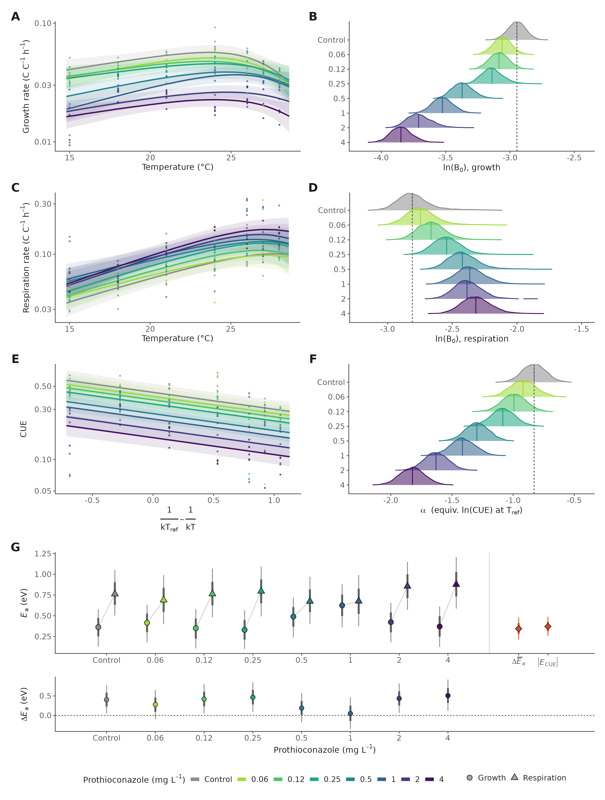
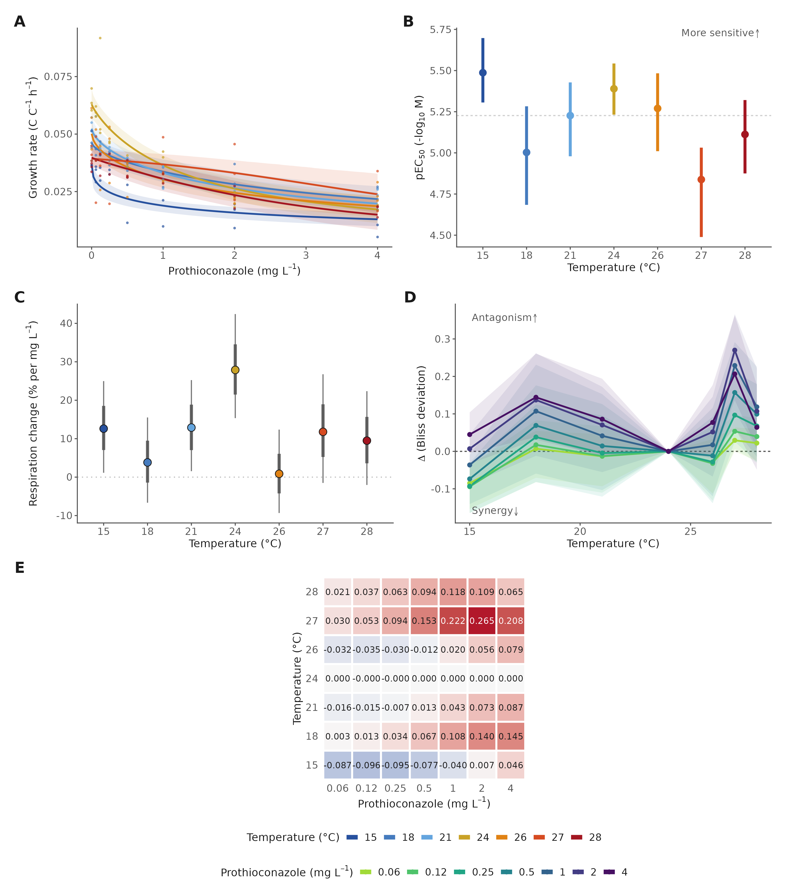
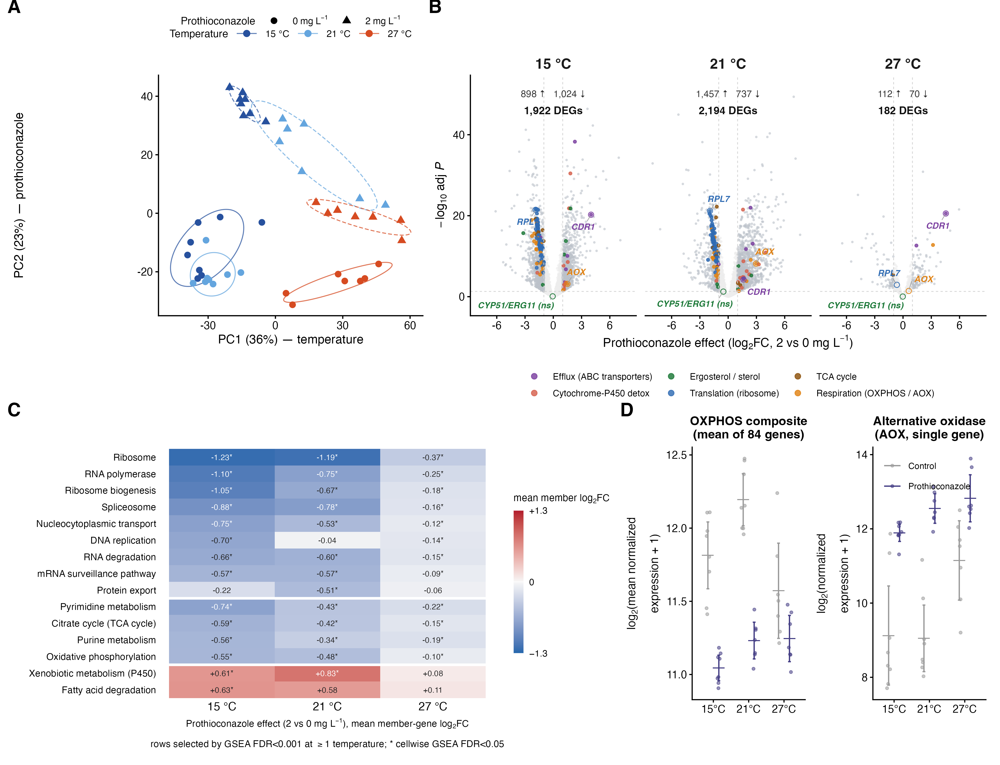
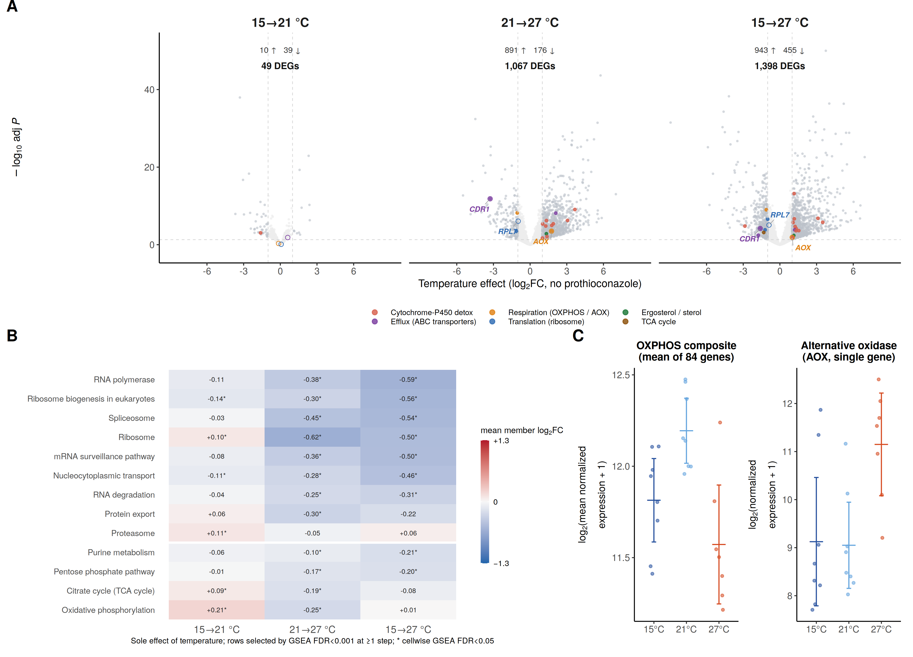
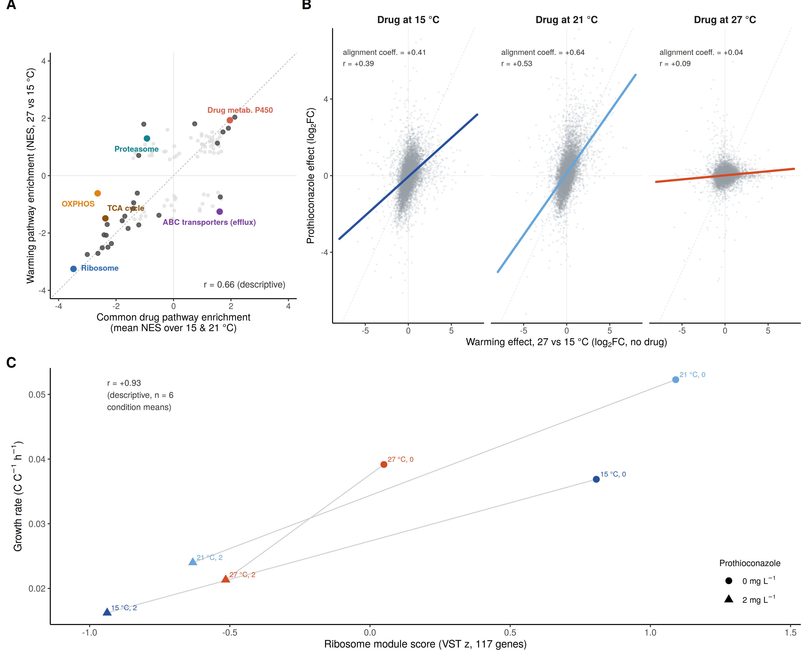
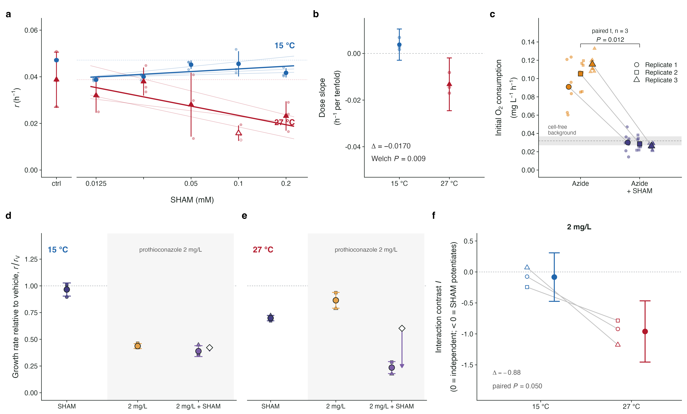

# Introduction

Fungal pathogens are among the most serious threats to global food security, destroying enough produce annually to feed hundreds of millions of people and placing persistent pressure on the small arsenal of chemistries available to control them [@fisher2018; @steinberg2020]. Few systems illustrate this dependence better than Septoria tritici blotch (STB), caused by the ascomycete *Zymoseptoria tritici*, one of the most damaging diseases of wheat in temperate Europe. The fungus enters through stomata and grows symptomlessly in the leaf apoplast for one to two weeks before switching to a destructive necrotrophic phase; this long latent period makes chemical control largely prophylactic and spray timing unforgiving [@steinberg2015]. Yield losses range from 5 to 20% even in well-managed crops and can approach half of the yield of susceptible cultivars in conducive seasons. Keeping the disease in check absorbs a large share of European fungicide expenditure, with annual costs to growers measured in hundreds of millions of euros [@fones2015; @torriani2015]. Control rests disproportionately on the azoles, sterol demethylation inhibitors that block the cytochrome P450 sterol 14α-demethylase CYP51 thereby depleting ergosterol, the principal sterol of its membranes, and disrupting membrane sterol composition [@cools2013]. Prothioconazole, a triazolinthione whose binding to *Z. tritici* CYP51 is mechanistically distinct from that of older triazoles [@parker2011], remains one of the most widely used molecules in European wheat. Yet the durability of this chemistry is eroding: decades of intense use have driven the sequential accumulation of CYP51 alterations, enhanced efflux and target overexpression, and field performance of the azole class has declined measurably across Europe [@cools2013; @jørgensen2022]. With registration pipelines narrowing and resistance advancing, understanding the conditions under which existing fungicides work well or badly has become as important as discovering new ones [@steinberg2020].

One of those conditions is temperature. Climate warming is redistributing crop pathogens polewards, altering infection risk, and reshaping the geography of disease pressure on the crops that feed most of humanity [@bebber2013; @chaloner2021]. The consequences of warming for the pathogens themselves have received sustained attention, and *Z. tritici* is known to harbour heritable variation in thermal sensitivity within and among populations [@lendenmann2016]. The consequences of warming for chemical control have not. Sensitivity is characterised almost exclusively in standardised assays at a single, near-optimal laboratory temperature, even though field populations experience fluctuating thermal regimes that are shifting and broadening under climate change. A recent synthesis concluded that the influence of temperature on fungicide effectiveness is among the most neglected dimensions of climate-change impacts on crop protection, with the available evidence scattered, largely phenomenological, and rarely mechanistic [@juroszek2022]. Fungicide dose recommendations, resistance-monitoring assays and regulatory efficacy testing are all implicitly premised on a temperature-invariant relationship between dose and effect. If that premise fails, then both the efficacy and the resistance-selection consequences of a given spray programme become functions of the weather.

Thermal physiology offers a quantitative framework for asking how it fails. The performance of ectothermic organisms follows unimodal thermal performance curves whose rising limbs, optima and collapse above the optimum are well described by thermodynamic models of enzyme kinetics and inactivation [@schoolfield1981; @angilletta2009]. The metabolic theory of ecology describes the Arrhenius-like temperature scaling of metabolic rates and supplies a common currency, the activation energy, for comparing fluxes within one organism [@gillooly2001; @brown2004]. Growth and respiration need not share the same temperature dependence, and whenever respiration is activated more steeply than growth, carbon-use efficiency (CUE), the fraction of assimilated carbon converted into biomass rather than respired, must decline with warming, with consequences for microbial carbon budgets [@manzoni2012; @smith2019]. For a pathogen under chemical attack, this framework makes the physiological context of drug exposure explicit: a cell near its thermal optimum, growing rapidly, is a different target from a cell at the edge of its niche whose energy budget is already strained.

How toxicant effects combine with thermal stress is a long-standing question in ecotoxicology, where interactions between chemicals and natural stressors are known to range from antagonism to strong synergy, with temperature among the most powerful modulators [@holmstrup2010; @noyes2009; @verheyen2023]. Null models such as Bliss independence provide the formal reference against which such interactions can be classified [@bliss1939]. Yet in plant pathology this framework has rarely been deployed, and almost never together with the physiological and molecular measurements needed to explain the interactions it detects. Several features of *Z. tritici* physiology provide plausible mechanisms for such interactions. Azole action is embedded in wider cell physiology: inhibition of ergosterol synthesis perturbs membrane composition with consequences that reach nutrient uptake, redox balance and respiration [@parker2014], and the target enzyme itself is not thermally neutral, with *Z. tritici* CYP51 showing temperature-sensitive catalytic activity in vitro [@price2015], a direct point of contact between the thermal and chemical axes of this study. Azole exposure elicits well-characterised transcriptional responses spanning the ergosterol pathway, efflux transporters and detoxification systems, and the fungus possesses an alternative oxidase (AOX), a cyanide-resistant terminal oxidase that sustains respiratory electron flow when the cytochrome pathway is compromised and that already underlies reduced sensitivity to complex III inhibitors in this species [@joseph-horne2001; @miguez2004]. Whether such respiratory flexibility shapes the temperature dependence of azole action is unknown.

Connecting molecular responses to whole-organism performance ultimately requires a model of the metabolic network in which both act. Genome-scale metabolic models (GEMs) predict growth from network structure by flux balance analysis [@orth2010], and successive layers of constraint have made them progressively more physiological: enzyme-constrained formulations cap fluxes by catalytic capacity and a finite proteome budget [@sanchez2017; @domenzain2022], and temperature-explicit extensions let enzyme activity and stability vary with temperature so that the organism's thermal performance curve emerges from network-level constraints on temperature-dependent enzyme capacities and stabilities [@li2021]. Machine-learning predictors of protein thermal stability and of temperature-dependent turnover numbers now allow such models to be parameterised for organisms lacking biochemical characterisation [@qiu2024]. These advances have not yet reached plant pathogens: to our knowledge, no curated metabolic reconstruction was available for *Z. tritici*, the only available drafts being uncurated automated reconstructions generated in an 834-species sweep [@castillo2023] which lack both the azole target reaction and the alternative oxidase (this study), the two ends of the mechanism at issue here.

Here we combine factorial physiology, transcriptomics and metabolic modelling to dissect how temperature and prothioconazole interact in *Z. tritici*. We measured biomass-specific growth, respiration and CUE across seven temperatures spanning the species' thermal niche and eight fungicide doses, fitted the resulting thermal performance and dose-response surfaces within a Bayesian framework, and tested the combined action of the two stressors against Bliss independence. We profiled the transcriptome across the temperature by fungicide factorial to identify the molecular strategies underlying the physiological responses. Finally, we reconstructed, to our knowledge, the first curated, enzyme- and temperature-constrained genome-scale metabolic model of *Z. tritici*, grounded in predicted enzyme stabilities and temperature-dependent turnover numbers, and used it to ask whether the observed interaction emerges from temperature-dependent enzyme and network constraints. We show that prothioconazole potency is strongly temperature-dependent and that the interaction reverses across the thermal optimum, from synergy in the cool range to antagonism under supra-optimal heat. We show that the transcriptional response to the drug converges on the response to warming itself and is strongly attenuated where heat has already engaged the same programmes. Finally, we show that a metabolic model in which the drug constricts CYP51 capacity while heat erodes enzyme function accounts for a substantial component of the interaction, pointing to respiratory rerouting through AOX and declining energetic efficiency as candidate mechanisms, while its structured failures localise the component associated with the shared transcriptional response. Together these results argue that chemical control of crop disease cannot be understood, or optimised, independently of the thermal physiology of its target.

# Results

## Prothioconazole suppresses growth but elevates respiration, collapsing carbon-use efficiency

We fitted Sharpe–Schoolfield thermal performance curves to biomass-corrected growth and respiration rates of *Z. tritici* across seven temperatures (15–28 °C) and eight prothioconazole doses (0–4 mg L⁻¹) (Fig. 1A–D; fit diagnostics in Fig. S1, posterior predictive checks in Fig. S2). Prothioconazole progressively lowered the baseline metabolic rate for growth: ln(B₀) declined from −2.95 in the control to −3.93 at 4 mg L⁻¹, a near three-fold reduction, with the posterior probability of a negative shift exceeding 0.99 at all doses ≥ 0.5 mg L⁻¹ (Fig. 1A,B). Other thermal-performance parameters showed no detectable treatment-dependent shifts, indicating that the drug reduced metabolic capacity without reshaping the thermal response.

Respiration moved in the opposite direction: baseline ln(B₀) increased from −2.79 to −2.29 (P(positive) > 0.98 for doses ≥ 0.5 mg L⁻¹; Fig. 1C,D), i.e. treated cells respired more per unit biomass even as they grew less. The consequence is a sharp loss of efficiency: modelling estimated carbon-use efficiency (CUE; derived from the fitted rates and a common cell-carbon conversion, Methods) as a Boltzmann–Arrhenius function with a shared thermal sensitivity (E = −0.40) and dose-specific intercepts, the intercept α fell from −0.86 (control) to −1.87 (4 mg L⁻¹), a roughly two-thirds reduction in predicted CUE, while the thermal sensitivity was unchanged (Fig. 1E,F). Together, these data indicate that prothioconazole does not simply arrest growth; it induces a metabolically costly state characterised by elevated biomass-specific respiration and reduced conversion of assimilated carbon into biomass.

{width=6.3in}

**Figure 1. Prothioconazole suppresses growth but increases respiration, collapsing carbon-use efficiency across the thermal range of *Zymoseptoria tritici*.** (A) Sharpe–Schoolfield thermal performance curves for biomass-corrected growth rate across seven temperatures (15–28 °C) and eight prothioconazole doses (0–4 mg L⁻¹). Lines show posterior medians and ribbons 95% credible intervals; colours encode dose (grey, solvent control; viridis ramp, increasing dose). (B) Posterior distributions of the dose-specific baseline growth parameter ln(B₀), showing progressive suppression of growth capacity with increasing concentration. (C) Sharpe–Schoolfield thermal performance curves for biomass-corrected respiration rate. (D) Posterior distributions of dose-specific ln(B₀) for respiration, showing increased biomass-specific respiration under prothioconazole. (E) Carbon-use efficiency (CUE = P/(P + R)) modelled as a Boltzmann–Arrhenius function of temperature with a shared thermal sensitivity and dose-specific intercepts; lines show posterior medians per dose and ribbons 95% credible intervals. (F) Posterior distributions of the dose-specific CUE intercept α, showing a progressive downward shift with increasing concentration. Raw-data fit diagnostics are in Fig. S1 and posterior predictive checks in Fig. S2.

## Fungicide potency is temperature-dependent, switching from synergy to antagonism across the thermal optimum

Hill dose–response modelling revealed that fungicide potency depends strongly on temperature (Fig. 2A,B; per-temperature fits in Fig. S3; model-form sensitivity in Methods). The half-maximal effective concentration (EC₅₀) for growth was lowest, i.e. the fungus was most sensitive, at 15 °C (1.12 mg L⁻¹, pEC₅₀ = 5.49) and highest at 27 °C (5.00 mg L⁻¹, pEC₅₀ = 4.82), an approximately 4.5-fold loss of potency at supra-optimal temperature. Respiration responded to dose in the opposite direction, increasing log-linearly with concentration at most temperatures, most steeply at the 24 °C optimum (Fig. 2C,D).

To test formally whether temperature and fungicide interact, we adapted Bliss independence to treat thermal deviation and fungicide exposure as two stressors, referenced to the thermal optimum (T_opt = 24 °C, the temperature of highest baseline growth), which served as the zero-deviation thermal reference (Fig. 2E,F). Below the optimum, the interaction was synergistic: at 15 °C the Bliss deviation was negative across low-to-intermediate doses, with the strongest synergy at 0.12 mg L⁻¹ (Δ = −0.096; P(synergy) = 1.0), and the pooled cool region (15–19 °C) showed a negative median deviation (−0.099). Above the optimum it reversed to antagonism, strongest at 27 °C (Δ = +0.27 at 2 mg L⁻¹; P(antagonism) > 0.999; pooled hot region 25–28 °C median +0.097). This synergy-to-antagonism reversal was robust to the choice of reference temperature (re-referencing to 21 °C left the synergistic and antagonistic calls unchanged) and to the Bliss reference formulation (Fig. S9). Relative to the Bliss expectation, cool temperatures therefore enhance the growth-suppressive effect of prothioconazole, whereas supra-optimal heat weakens it.

{width=6.3in}

**Figure 2. Fungicide potency is temperature-dependent and the temperature × fungicide interaction reverses across the thermal optimum.** (A) Hill dose–response curves for growth at each temperature (posterior medians with 95% credible ribbons; colours encode temperature from cool blue to hot red; per-temperature panels with data in Fig. S3). (B) Temperature-specific potency (pEC₅₀, the negative log₁₀ EC₅₀ in mol L⁻¹): the fungus is most sensitive at 15 °C and least sensitive at 27 °C. (C) Respiration versus dose (log-linear model, posterior lines per temperature). (D) Respiration dose slopes by temperature, steepest near the 24 °C optimum. (E) Bliss deviation Δ versus temperature for each concentration (posterior medians, 95% credible ribbons; dashed line, Bliss independence Δ = 0; the 24 °C thermal optimum is the zero-deviation reference). Negative Δ indicates synergy, positive Δ antagonism. (F) Heatmap of posterior mean Δ for each temperature × concentration combination, showing synergy at cool and antagonism at supra-optimal temperatures. Robustness to the reference choice and dose range is shown in Fig. S9.

## Prothioconazole triggers a temperature-dependent transcriptional response

To resolve the mechanism, we sequenced the transcriptomes of six treatment groups (15, 21 and 27 °C, each at 0 and 2 mg L⁻¹ prothioconazole; 7–8 replicates per group), bracketing the thermal optimum and sampling the synergistic (15 °C) and antagonistic (27 °C) regions of the interaction. Principal-component analysis cleanly separated samples by temperature (PC1, 36% of variance) and by fungicide (PC2, 23%), showing that both factors strongly structure transcriptomic variation (Fig. 3A).

The prothioconazole response was large and strongly temperature-dependent. The drug significantly altered 1,922 genes at 15 °C and 2,194 at 21 °C (adjusted P < 0.05, |log₂FC| ≥ 1), but only 182 at 27 °C, an approximately ten-fold contraction (Fig. 3B). A formal interaction test confirmed this temperature dependence gene by gene: 2,409 genes responded to the drug differently across temperatures (likelihood-ratio test, adjusted P < 0.05), and among interaction genes contrasting 27 °C with 15 °C, 97% showed attenuation rather than amplification of the drug response. At the cool and near-optimal temperatures the cell mounted a clear xenobiotic-defence programme: ATP-binding-cassette efflux pumps were strongly induced (CDR1, +4.0 log₂FC; SNQ2) together with glutathione-S-transferases, whereas the drug target itself was barely affected, with CYP51/ERG11 not significantly induced at any temperature and the ergosterol pathway only mildly perturbed (Fig. S4). The magnitude of the transcriptome-wide drug response, quantified per gene, likewise contracted with warming (median |log₂FC| of drug-responsive genes falling by roughly a third at 27 °C relative to 15 °C; Fig. S5). Excluding the lowest-depth libraries did not alter these conclusions (per-gene log₂FC correlation with the full data ≥ 0.97; Methods).

{width=6.3in}

**Figure 3. Prothioconazole engages a temperature-dependent transcriptional programme.** (A) Principal-component analysis of all RNA-seq samples (top 500 variable genes; n = 7–8 per group). Points are coloured by temperature and shaped by prothioconazole dose (circles, 0; triangles, 2 mg L⁻¹), with outline ellipses per group. (B) Volcano plots of the prothioconazole effect (log₂FC, 2 versus 0 mg L⁻¹) at 15, 21 and 27 °C. Genes passing adjusted P < 0.05 and |log₂FC| ≥ 1 are tallied (↑ up, ↓ down); selected KEGG categories are coloured (legend) and the largest-effect symbol-named gene per category is labelled. The azole target CYP51/ERG11 (black-outlined point) is not significantly induced at any temperature. (C) Data-driven KEGG pathway heatmap (gene-set enrichment analysis; pathways at FDR < 0.001 in at least one temperature); cell colour is the mean member log₂FC and asterisks denote the GSEA FDR. (D) Classical respiration (oxidative phosphorylation, OXPHOS) versus alternative oxidase (AOX) expression in control and treated cultures. Bars show group means; error bars 95% confidence intervals (n = 7–8). The ergosterol pathway in detail is in Fig. S4; effect-size attenuation at 27 °C in Fig. S5; the full pathway landscape and gene-level view in Figs S6 and S7.

## Ribosome repression and respiratory rerouting link the transcriptome to reduced growth, elevated respiration and declining CUE

Data-driven pathway analysis (gene-set enrichment over a restricted KEGG universe; Fig. 3C, full pathway landscape in Fig. S6, gene-level view in Fig. S7) tied the transcriptome directly to the physiology. The dominant signal was repression of the growth machinery: ribosomal-protein and ribosome-biogenesis genes were strongly down-regulated (mean member log₂FC −1.23 and −1.05 at 15 °C), consistent with the drug-induced reduction in growth in Fig. 1A,B.

The apparent respiratory paradox, increased respiration despite repression of the canonical respiratory chain, was resolved by the opposing regulation of two terminal pathways. The classical, ATP-coupled respiratory chain (oxidative phosphorylation, TCA cycle) was repressed by the drug (mean log₂FC −0.55 and −0.59), yet the non-phosphorylating alternative oxidase (AOX) was strongly induced (Fig. 3C,D). AOX consumes oxygen without conserving energy as ATP; its induction therefore provides a plausible mechanism by which oxygen consumption could increase (Fig. 1C,D) while less carbon is retained as biomass (lower CUE; Fig. 1E,F), a mechanism tested quantitatively with the metabolic model below. In absolute terms, AOX expression increased with both temperature and prothioconazole; however, because AOX was already elevated at 27 °C, the incremental fold-change induced by the drug was reduced, consistent with the marked attenuation of the overall response. Consistent with broader metabolic reorganisation, fatty-acid biosynthesis, β-oxidation and peroxisomal genes were concomitantly up-regulated, alongside an oxidative-stress (glutathione/antioxidant) response. Notably, the drug-target pathway itself was only mildly perturbed and CYP51 was not transcriptionally up-regulated, indicating no evidence, under these conditions, for the transcriptional target-overexpression compensation seen in some resistant field strains.

## Temperature alone reshapes the transcriptome in two phases

To separate the drug response from the cell's intrinsic thermal response, we examined temperature alone in untreated controls (Fig. 4). Warming from 15 to 21 °C, toward the thermal optimum, changed remarkably little (49 genes), whereas warming to the supra-optimal 27 °C elicited a genome-wide response of roughly 1,400 genes (Fig. 4A). At the pathway level this response was two-phase (Fig. 4B): from 15 to 21 °C oxidative phosphorylation, the proteasome and translation were mildly induced, consistent with ramping toward maximal growth, whereas from 21 to 27 °C the entire gene-expression machinery (ribosome, ribosome biogenesis, RNA polymerase, spliceosome) was strongly repressed, consistent with a supra-optimal heat-stress response. Classical respiration peaked near the optimum and declined at 27 °C, while the alternative oxidase was strongly induced at 27 °C (Fig. 4C), a temperature-driven shift toward non-phosphorylating respiration that mirrors the drug-induced shift in Fig. 3D. Notably, this supra-optimal response was dominated by translational shutdown rather than a classical heat-shock or chaperone induction.

{width=6.3in}

**Figure 4. Temperature alone reshapes the transcriptome in two phases.** All panels use control (no-prothioconazole) samples. (A) Volcano plots of the pure thermal response for the three warming steps (15→21, 21→27 and 15→27 °C), with significant genes tallied as in Fig. 3B. The transcriptome barely changes from 15 to 21 °C (49 genes) and then mounts a genome-wide response beyond the thermal optimum. (B) KEGG pathway GSEA heatmap (pathways at FDR < 0.001 in at least one step); cell colour is the mean member log₂FC. Translation, respiration and proteasome pathways are mildly induced toward the optimum, whereas the gene-expression machinery is strongly repressed at 27 °C. (C) Classical respiration (OXPHOS) and alternative oxidase (AOX) expression across temperature. Bars show group means; error bars 95% confidence intervals (n = 7–8).

## Prothioconazole and temperature converge on shared programmes that track whole-organism physiology

Because temperature and prothioconazole each remodel overlapping parts of metabolism, we compared their transcriptional programmes directly. At the pathway level the drug response (pooled over the engaged 15 and 21 °C) and the warming response (27 versus 15 °C) were strongly and positively correlated (Pearson r = 0.66; Fig. 5A): the same growth and energy programmes (ribosome, oxidative phosphorylation, TCA cycle, proteasome) were repressed by both perturbations, with ABC-transporter efflux the sole drug-specific exception. This convergence was itself temperature-dependent (Fig. 5B): the gene-level alignment between the drug effect and the warming programme was steep when the drug was applied at 15 °C (slope 0.41) and 21 °C (slope 0.64) but essentially vanished at 27 °C (slope 0.04; gene-level concordance in Fig. S8).

These transcriptional programmes track whole-organism physiology quantitatively. Across the six conditions, the ribosome module score was strongly correlated with growth rate (Pearson r = +0.93; Fig. 5C), and the AOX module score was strongly inversely correlated with carbon-use efficiency (r = −0.98; Fig. 5D; extended module–trait correlations in Fig. S10). Together these results provide a mechanistic hypothesis for the Bliss interaction (Fig. 2E,F): because prothioconazole and temperature converge on the same machinery, their effects compound below the thermal optimum, whereas at supra-optimal temperature heat has already repressed that machinery, leaving little for the fungicide to act upon.

{width=6.3in}

**Figure 5. Prothioconazole and temperature converge on shared programmes that track whole-organism physiology.** (A) Pathway-level convergence: each point is a KEGG pathway, plotted by its normalized enrichment score (NES) for the drug response (pooled over the engaged 15 and 21 °C) versus the warming response (27 versus 15 °C, no drug). Most pathways fall on the diagonal in the lower-left quadrant (both perturbations repress the same growth and energy programmes; Pearson r = 0.66); ABC-transporter efflux is the drug-specific exception. (B) Gene-level alignment of the drug response with the warming programme as a function of the temperature at which the drug is applied: steep at 15 °C (slope 0.41) and 21 °C (0.64), flat at 27 °C (0.04). Gene-level concordance is shown in Fig. S8. (C) The ribosome module score is strongly correlated with growth rate across the six conditions (Pearson r = +0.93). (D) The AOX module score is strongly inversely correlated with carbon-use efficiency (r = −0.98). Points are coloured by temperature and shaped by dose; extended module–trait correlations are in Fig. S10.

## A genome-scale metabolic model accounts for a substantial component of the temperature × fungicide interaction

To examine how these mechanisms could be accommodated within a metabolic network, we reconstructed, to our knowledge, the first curated genome-scale metabolic model of *Z. tritici* (ztGEM; 3,959 reactions, 1,890 genes, including the azole target CYP51 and the alternative oxidase, both absent from existing automated drafts; Methods) and made it enzyme- and temperature-constrained by predicting each of its 742 enzymes' melting temperature from sequence and layering temperature-dependent turnover predictions on the enzymatic reactions, of which 60 yielded statistically and thermodynamically admissible thermal fits and the remainder retained the default thermal model (Fig. S11A,B; Methods). Because per-enzyme catalytic optima cannot yet be predicted from sequence, they were anchored at the measured growth optimum (24 °C; Methods); no other growth information entered the model. The resulting curve peaked at 24.0 °C, as anchored, and its genuinely emergent features are its shape, its absolute magnitude and its high-temperature failure, which arises as the most thermolabile essential enzymes unfold (Fig. 6A). As a separate identifiability analysis, Bayesian calibration of four global enzyme parameters against the measured control TPC (Methods) identified a single curve-constrained correction: the calibration favoured substantially lower effective thermal stability than predicted from sequence (posterior median −14.1 K, abutting the −15 K prior bound, so the magnitude is bound-limited rather than fully identified), consistent with in-vivo thermal failure preceding full protein unfolding. The in-vivo catalytic-efficiency multiplier remained unconstrained (×0.92, 90% CI 0.31–2.99), and no parameter combination reconciled the model's ~3-fold overestimate of absolute growth rate with the curve's shape without degrading the optimum (Fig. S11D); all downstream analyses therefore use the uncalibrated model.

Constraining the model with each condition's measured growth and respiration, which are imposed rather than predicted, then revealed how the flux state must reorganise to satisfy them (Fig. 6B). At 15 and 21 °C without drug, the condition-constrained model used no AOX flux at all (0% of oxygen consumption in all Monte-Carlo draws), whereas in the drug conditions the parsimonious flux solution routed a substantial share of oxygen consumption through AOX (median 13% of O₂ at 15 °C, 24% at 21 °C and 42% at 27 °C with drug), and this model-inferred AOX share closely tracked the independently measured AOX transcript abundance across the six conditions (Spearman ρ = 0.99; Fig. S11C). AOX is selected by the minimum-total-flux solution rather than being required by the constraints: blocking AOX entirely leaves every condition feasible, with oxygen instead passing through the cytochrome chain and a compensating reduction in substrate-level ATP production (phosphoglycerate kinase, pyruvate kinase and succinate-CoA ligase), at a 0–4% increase in total flux (Fig. S13B). The solution is also objective-dependent: although the terminal oxidase step itself draws roughly four-fold less enzyme per oxygen consumed than the cytochrome route in the enzyme-constrained model, minimising total protein rather than total flux returns solutions that use little or no AOX, and the whole-proteome cost of the two states is indistinguishable. The combination of high oxygen consumption with low biomass production therefore implies reduced energetic efficiency that the network can accommodate in more than one way, and the transcriptional data, rather than the model, strongly support AOX as the route preferentially engaged in vivo. The energetic consequence is severe: the model-derived effective ATP yield per oxygen atom (total ATP-synthase flux divided by oxygen consumed, a whole-network quantity rather than a mitochondrial biochemical constant) collapses from ~1.3 in the cool controls to ~0.07 under combined drug and heat (Fig. 6D), a mechanistic account of the CUE collapse in Fig. 1E,F.

Finally, the temperature dependence of potency could be captured by enzyme-level constraints. A safety-margin model, in which CYP51 catalytic capacity rises with temperature (Arrhenius activation energy 0.47 eV) while sterol demand tracks growth, yields EC₅₀(T) rising above the optimum and is better supported than binding-thermodynamics and temperature-invariant alternatives (AICc; Fig. 6C). Implemented inside the enzyme-constrained model as a temperature-dependent CYP51 capacity under competitive inhibition, the model returns EC₅₀ values of 1.93, 2.05 and 4.91 mg L⁻¹ at 15, 21 and 27 °C, against observed values of 1.12, 2.04 and 5.00 mg L⁻¹ (Fig. 6C). This is an explanatory fit rather than a forecast: the capacity parameters are estimated from the seven measured EC₅₀ values, and in leave-one-temperature-out tests the model does not recover a held-out estimate (Fig. S13A), so it should be read as a mechanistic account of the observed temperature dependence rather than as predictive of unseen temperatures. Extending the dose scans to the full factorial, the same mechanism reconstructed the complete relative-growth surface across all 49 treated temperature × dose conditions (r = 0.83 against the Hill-characterised surface; Fig. S12A,B), using only the control thermal performance curve and the capacity parameters estimated from the EC₅₀ values, so that the dose dimension at each temperature is generated rather than fitted. The residuals are themselves informative. Because capacity enters as a hard flux bound, the model produces a threshold-like dose response rather than the graded decline that is measured, so it predicts no effect at doses below the threshold at which CYP51 becomes limiting (31 of 49 conditions). The consequence is that the model reproduces the interaction where inhibition is strong, capturing synergy at 15 °C and antagonism at high dose, but predicts no interaction at low doses, and the largest and most systematic discrepancies fall at supra-optimal temperatures where the measured antagonism at low dose is strongest and the transcriptional drug response is most attenuated (Figs 3–5). The component of the interaction that the enzyme-level mechanism fails to reproduce therefore coincides with the conditions in which the shared stress programme is engaged. The model's structural conclusions were also robust to its two main parameterisation choices: re-anchoring enzyme catalytic optima at 20–26 °C moved the curve's peak as expected but left CTmax (36.7–36.8 °C), the maximum rate and the collapse shape unchanged (Fig. S12C), and enriching the model medium with amino-acid and nucleobase uptakes increased, rather than removed, the inferred AOX shares (Fig. S12D), making the sucrose-minimal medium the conservative choice. A substantial component of the observed temperature dependence of prothioconazole action can therefore be accounted for by temperature-dependent enzyme capacities and network-level flux constraints, while the component that these constraints fail to reproduce coincides with the conditions in which the shared transcriptional stress response is engaged.

{width=6.3in}

**Figure 6. An enzyme- and temperature-constrained genome-scale metabolic model accounts for a substantial component of the temperature × fungicide interaction.** (A) The thermal performance curve of the uncalibrated model (line) against the measured control TPC (points; dashed vertical line, 24 °C). Per-enzyme catalytic optima were anchored at the measured growth optimum (Methods), so the peak position is anchored rather than emergent; the curve's shape, magnitude and high-temperature collapse derive from sequence-predicted enzyme parameters. Bayesian calibration of the four global enzyme parameters is reported as an identifiability analysis in Fig. S11D. (B) Condition-constrained flux analysis: the AOX share of total oxygen consumption in the parsimonious flux solution reconciling each condition's measured growth and respiration (posterior medians and 95% Monte-Carlo intervals; circles, 0 mg L⁻¹; triangles, 2 mg L⁻¹). Drug conditions are resolved by substantial respiratory rerouting that increases with temperature (AOX is selected by the minimum-total-flux criterion and is not the only feasible route; Fig. S13B); the correspondence with measured AOX transcripts (Spearman ρ = 0.99) is shown in Fig. S11C. (C) The temperature dependence of potency: observed EC₅₀ (points), the enzyme-level safety-margin model (line; CYP51 catalytic capacity rising with an activation energy of 0.47 eV against growth-driven sterol demand), and EC₅₀ values returned by dose scans of the full metabolic model (diamonds; 1.93, 2.05 and 4.91 mg L⁻¹ at 15, 21 and 27 °C). (D) The model-derived effective ATP yield per oxygen collapses from ~1.3 in cool controls to ~0.07 under combined drug and heat (posterior medians and 95% Monte-Carlo intervals), a modelled energetic basis consistent with the decline in CUE (Fig. 1E,F). Model grounding diagnostics are in Fig. S11A,B.

# Discussion

Combining quantitative physiology, transcriptomics and genome-scale metabolic modelling, we show that temperature is not a passive backdrop to fungicide action in *Z. tritici* but an active determinant of it. Prothioconazole drives cells into a costly, energetically inefficient stress state (repression of growth-associated programmes, reduced canonical respiratory investment, induction of the alternative oxidase, and metabolic reorganisation consistent with increased maintenance and storage allocation) that provides a coherent account of reduced growth, elevated respiration and reduced carbon-use efficiency. An overlapping programme is engaged by supra-optimal temperature, and where heat has already activated it, prothioconazole produces a reduced incremental effect. This offers a coherent molecular account of the temperature-dependent efficacy seen physiologically: synergy under cool conditions and antagonism under supra-optimal heat. Critically, when these mechanisms were encoded in an enzyme- and temperature-constrained metabolic model, a substantial component of the interaction re-emerged from the behaviour of a finite, thermally constrained metabolic network under simultaneous chemical and thermal load, while the structured residuals localised the conditions in which enzyme-level constraints alone were insufficient, and these coincided with engagement of the shared transcriptional stress response.

A central feature of this response is the alternative oxidase. AOX is a cyanide-resistant, non-phosphorylating terminal oxidase widely implicated in fungal stress tolerance [@joseph-horne2001]. It is also an established modulator of fungicide sensitivity: by bypassing the cytochrome bc1 complex, AOX can sustain respiration when quinone-outside inhibitor (QoI/strobilurin) fungicides inhibit the canonical chain, including in *Z. tritici* [@wood2003; @miguez2004]. Our results extend the relevance of AOX beyond respiratory-targeting fungicides by showing strong AOX induction during exposure to an azole that acts primarily on sterol biosynthesis. This induction reconciles the otherwise paradoxical pairing of increased respiration with decreased growth and CUE: oxygen consumption can increase through a non-phosphorylating route without a corresponding increase in biomass production. The metabolic model strengthens this interpretation: within the constrained network, rerouting through AOX is the reconciliation selected by the minimum-total-flux solution. When each condition's measured rates are imposed as constraints, the parsimonious flux state reroutes oxygen through AOX in precisely the drug-exposed conditions, rising from 13% of oxygen consumption at 15 °C to 42% under combined drug and heat, and this model-inferred share tracks the independently measured AOX transcript abundance across all six conditions (Spearman ρ = 0.99). Identifiability testing shows that the network is not mathematically obliged to use AOX, since blocking it leaves the physiology feasible by shifting ATP production from substrate-level phosphorylation to the cytochrome chain, at a 0–4% flux penalty (Fig. S13B); the evidence for AOX is therefore a triangulation, in which the physiology implies reduced energetic efficiency, the minimum-total-flux solution selects AOX among several feasible resolutions, and the transcriptome independently supports AOX as the route preferentially engaged in vivo. That the optimiser's preferred solution among feasible alternatives coincides so closely with the measured expression pattern is more informative than it would be had AOX been structurally forced. The corresponding modelled decline in the effective ATP yield per oxygen, from ~1.3 to ~0.07, provides a mechanistic account consistent with the measured decline in CUE. That both prothioconazole and heat induce AOX suggests that it forms part of a broader stress programme and may contribute to cross-protection, whereby prior exposure to one stress alters tolerance to another [@berry2008]. A cell already shifted toward this state under heat stress may experience a smaller incremental metabolic impact when exposed to prothioconazole. However, the precise causal route (cross-protection, altered uptake or efflux, or a broader change in physiological state) remains to be dissected, and AOX's contribution should be tested directly using genetic or pharmacological perturbation.

Why should a sterol-synthesis inhibitor and heat converge on the same programme at all? One plausible point of mechanistic contact is the membrane itself. Membrane fluidity is a primary temperature sensor in fungi, coupled to the heat-stress regulatory circuitry [@leach2014], and azole inhibition of ergosterol synthesis perturbs exactly the membrane composition on which that sensing depends. Azole-induced disruption of ergosterol synthesis and sterol composition may therefore be read by the cell, in part, as a thermal signal, recruiting the overlapping stress physiology we observe. Consistent with this, the supra-optimal response in our data was dominated by repression of the translational apparatus rather than by the classical chaperone induction that typifies acute heat shock in fungi [@bakar2020; @neves-da-rocha2023], suggesting a physiological state distinct from a canonical acute heat-shock response and, given the multi-day exposure, consistent with longer-term physiological rebalancing, the kind of state a slow-acting fungicide is likely to encounter in the field.

The metabolic model also suggests a mechanistic basis for the temperature dependence of potency itself. In the uncalibrated model, enzyme stabilities and the temperature dependence of turnover are predicted from sequence, with catalytic optima anchored at the measured growth optimum (Methods); the curve's shape, magnitude and high-temperature failure are its emergent features. Bayesian calibration against the control thermal performance curve constrained only one of its four global parameters, shifting effective enzyme melting temperatures roughly 14 K below their sequence-predicted values, a shift that is biologically plausible given that cellular performance deteriorates well before the average protein unfolds in vitro, although the parameter was weakly identified and approached its prior bound. Within this framework, azole potency declines with warming because CYP51 catalytic capacity rises with temperature (apparent activation energy 0.47 eV) faster than the sterol demand imposed by growth: at supra-optimal temperature the enzyme runs with a larger safety margin, so more inhibitor is needed to make demethylation limiting. This safety-margin mechanism is anchored in enzymology, as *Z. tritici* CYP51 shows temperature-sensitive catalytic behaviour in vitro [@price2015], was better supported by AICc than the binding-thermodynamics and temperature-invariant alternatives tested (although it interpolates the measured relationship rather than forecasting unseen temperatures; Fig. S13A), and, implemented inside the enzyme-constrained model, returned EC₅₀ values of 1.93, 2.05 and 4.91 mg L⁻¹ at 15, 21 and 27 °C against observed values of 1.12, 2.04 and 5.00 mg L⁻¹. The upward miss at 15 °C may indicate that enzyme-level constraints capture only part of the enhanced cold sensitivity; the synergistic transcriptional convergence documented in Figures 3–5 provides one plausible additional contribution. Consistent with this partition, the full-surface reconstruction (Fig. S12A,B) reproduces the interaction where enzyme kinetics suffice, in cool synergy and high-dose antagonism, but predicts no interaction at supra-optimal temperatures and low doses, exactly where the measured antagonism coincides with the attenuated transcriptional response: the enzymatic and regulatory components of the interaction are separable and operate in distinct regions of the dose–temperature plane.

The applied implication is clear. Prothioconazole potency against *Z. tritici* declined approximately 4.5-fold from 15 °C to 27 °C, and the transcriptional response to prothioconazole was strongly attenuated at 27 °C. Because fungicide sensitivity is routinely assayed at a single near-optimal temperature, standard testing may overestimate activity whenever infections or treated populations experience supra-optimal temperatures. As cropping climates warm and pathogen distributions shift polewards [@bebber2013], this temperature dependence could become increasingly relevant to field efficacy. Temperature-resolved efficacy testing, and disease models that treat fungicide performance as temperature-dependent, are therefore warranted; the safety-margin model offers a compact mechanistic parameterisation, involving only an activation energy and a reference potency, although its failed leave-one-temperature-out performance means that independent calibration and validation would be required before any forecasting application. The antagonism we observe is not explained by CYP51 transcriptional up-regulation, suggesting an environmentally mediated route to reduced control that conventional resistance monitoring could miss: this loss of potency is distinct from heritable resistance, yet single-temperature sensitivity assays could confound or overlook the distinction. Resistance to single-site fungicides, including azoles, has repeatedly evolved in *Z. tritici* and remains central to resistance management [@lucas2015]; our results add an orthogonal environmental axis of variation in efficacy that can arise without detectable target-overexpression compensation.

Several limitations temper these conclusions. The transcriptome–physiology link is correlative; functional tests (AOX perturbation, sterol profiling, efflux assays) are needed to establish causality. The RNA-seq sampled a single dose at three temperatures, and a fraction of the prothioconazole-responsive genes are uncharacterised *Z. tritici* genes whose roles remain unknown and provide candidates for follow-up. RNA yield varied among treatments, but normalisation and sensitivity analyses indicated that this did not drive the main conclusions. On the modelling side, the reconstruction is orthology-based, and enzyme parameters derive from sequence-based predictors rather than direct biochemical measurements. A uniform baseline turnover number was assumed before temperature scaling, and the model medium is a sucrose minimal approximation of the complex YMS growth medium, although a medium-enrichment analysis indicated that the inferred AOX shares are, if anything, larger under richer uptake (Fig. S12D). Moreover, the four global calibration parameters are only weakly identified by a single thermal performance curve: in the final calibration only the melting-temperature shift was curve-constrained (−14.1 K, 90% CI −15.0 to −11.0, abutting the prior bound), while the catalytic-efficiency multiplier spanned ×0.31–2.99, and the posterior traded the measured optimum against the falling limb rather than closing the ~3-fold magnitude gap (Fig. S11D). Two identifiability tests further bound what the modelling establishes: the CYP51 capacity model interpolates the measured EC₅₀–temperature relationship but does not recover held-out temperatures, and the network does not uniquely require AOX, since blocking it leaves the measured physiology feasible, by rebalancing ATP production between substrate-level and oxidative routes, at a small flux penalty (Fig. S13), and the inferred routing depends on whether total flux or total protein is minimised. The modelling should therefore be read as a mechanistic consistency and inference framework rather than a predictive one: its value lies in reproducing observed patterns across physiological, transcriptional and metabolic scales, of which the AOX transcript comparison is the cleanest independent test, rather than in point estimates of its parameters or in extrapolation. Two design constraints also warrant note: each temperature was maintained in a dedicated incubator, so temperature and incubator effects cannot be formally separated (the smooth, unimodal response across seven temperatures and the concordance of physiology, transcriptomics and modelling argue against a simple incubator artefact, but do not exclude it), and because cultures were harvested at a comparable physiological stage rather than a fixed clock time, elapsed culture age co-varied with temperature. Finally, results from a single isolate under controlled conditions require validation across genetic backgrounds and in planta, where host physiology, fluctuating temperature and the latent phase of infection may modulate the interaction.

# Conclusion

Integrating physiology, transcriptomics and genome-scale metabolic modelling provides a mechanistic framework linking enzyme thermodynamics, cellular physiology and temperature-dependent fungicide action. Prothioconazole induces an energetically inefficient stress state, consistent with respiratory rerouting through AOX, that overlaps the cell's own response to supra-optimal heat; where heat has already engaged much of that programme, the incremental response to the fungicide is strongly attenuated, and the observed decline in potency can be partly accounted for by a growing catalytic safety margin around CYP51 as temperature rises. Several links in this chain are quantitatively supported: the measured loss of carbon-use efficiency is consistent with a modelled decline in the effective ATP yield per oxygen, the model-inferred AOX flux closely tracks measured AOX transcript abundance, and a substantial component of the observed temperature dependence of EC₅₀ can be accounted for by enzyme-level constraints on CYP51 capacity. Together, these results show that fungicide potency depends on the thermal physiological state of the pathogen, and they support incorporating temperature dependence into sensitivity assays, dose models and resistance monitoring as cropping climates become warmer and more thermally variable.

# Materials and Methods

Strain and culture

*Zymoseptoria tritici* isolate IPO323 (reference genome IPO323, assembly MG2 [@goodwin2011]) was cultured in yeast malt sucrose (YMS) medium (4 g L⁻¹ yeast extract, 4 g L⁻¹ malt extract, 4 g L⁻¹ sucrose) following @kellner2014. Precultures were inoculated from frozen stock into liquid YMS and grown for 4 days at 21 °C with shaking at 200 rpm, then passed through a 100 µm cell strainer to remove hyphal clumps; the resulting cell suspension was used to inoculate the growth and respiration assays, which were run in the same medium at the assayed temperatures. Prothioconazole (PESTANAL analytical standard; Sigma-Aldrich) was dissolved in dimethyl sulfoxide (DMSO) and diluted into YMS immediately before each assay; all treatments, including the no-fungicide solvent controls, contained the same final DMSO concentration (0.4%, v/v). The eight nominal concentrations were 0 (solvent control), 0.06, 0.12, 0.25, 0.5, 1, 2 and 4 mg L⁻¹.

Growth and respiration assays

Dissolved oxygen is the directly measured quantity throughout; specific growth and respiration rates are estimates derived from a mechanistic model fitted to the oxygen trajectories, not independent respirometry. Growth and respiration were derived from dissolved-oxygen consumption time series recorded for each temperature × dose × replicate across seven temperatures (15, 18, 21, 24, 26, 27 and 28 °C) and eight prothioconazole concentrations (0–4 mg L⁻¹). Dissolved oxygen was measured with SensorDish® readers (PreSens Precision Sensing GmbH, Regensburg, Germany), which monitor up to 24 vials per plate noninvasively through optical sensor spots containing a fluorescent dye whose quenching by oxygen reports the oxygen partial pressure. Readers were factory-calibrated, and before each run a two-point calibration against 0% and air-saturated oxygen was performed following the manufacturer's protocol. All liquid handling was carried out aseptically in a laminar-flow hood using sterile, manufacturer-supplied vials. Up to three replicate 5 ml vials per temperature × dose combination were inoculated from a single common culture batch (replicate vials, not independent biological cultures) at OD₆₀₀ = 0.0005 (approximately 1 × 10⁷ cells L⁻¹, confirmed by haemocytometer counts), filled to slight convexity to eliminate headspace, and sealed with gas-tight caps. Sealed vials were placed on the readers in temperature-controlled incubators held at each set point, allowed ~45 min for the optical signal and baseline to stabilise, after which dissolved oxygen was logged at 1-min intervals over multi-day runs until oxygen was substantially depleted. All seven temperatures were assayed in parallel on the same day from a single common culture batch, each in a separate temperature-controlled incubator with its SensorDish reader linked to a shared acquisition unit; temperature and incubator are therefore confounded in this design.

Growth and respiration rates were estimated from each dissolved-oxygen time series using the mechanistic oxygen-consumption model of @cakin2026, which couples exponential population growth with biomass-proportional oxygen uptake. Assuming exponential growth with specific growth rate $r$,

$$N(t) = N_0\,e^{rt},$$

and oxygen uptake proportional to biomass with per-cell respiration $R$,

$$\frac{\mathrm{d}O_2}{\mathrm{d}t} = -R\,N(t),$$

integration gives

$$O_2(t) = O_{2,0} - \frac{R\,N_0}{r}\left(e^{rt} - 1\right).$$ Each trace was smoothed with a cubic spline to locate the onset of sustained oxygen decline, trimmed to the interval of approximately exponential growth, re-zeroed, and normalised to a reference oxygen level defined as the mean of its first three retained points; the normalised model

$$O(t) = O_0 + \frac{k}{r}\left(1 - e^{rt}\right),$$

in which $k$ is the initial fractional oxygen-decline rate, was then fitted to each replicate by bounded nonlinear least squares (nlsLM, minpack.lm). The specific growth rate r and the decline rate k were estimated per replicate, and per-cell respiration was recovered by combining k with the reference oxygen level and the initial cell density (N₀); N₀ was reconstructed from the inoculation density (Ninoc, from haemocytometer counts) and the measured delay $\Delta t$ between inoculation and the start of the fitted window, $N_0 = N_{\mathrm{inoc}}\,e^{r\Delta t}$. In total, 168 oxygen traces were recorded (seven temperatures × eight doses × three vials). A trace was retained when the oxygen model converged on the selected fit window and yielded positive growth and respiration estimates; fit windows and sample exclusions were set with an interactive trim-selection tool applied before treatment-level analysis, and fit quality (RMSE, R², parameter-boundary flags) was recorded as diagnostics (Table S: supp_tpc_fit_quality) rather than applied as an automatic cutoff; 157 of 168 traces were retained (46 of the 56 temperature × dose groups with three vials, 9 with two and 1 with one).

Rates were placed on a common carbon basis using the cell-geometry and carbon-density assumptions of the same framework (cell dimensions 2.5 × 70 µm; carbon density 100 fg µm⁻³; 1:1 O₂:C molar ratio, respiratory quotient 1) and biomass-corrected, and carbon-use efficiency (CUE) was computed as carbon-based production divided by the sum of production and respiration, $\mathrm{CUE} = P/(P + R)$. The assumed cell size (2.5 × 70 µm) reflects the elongated conidial morphology reported for *Z. tritici* (yeast-like blastospores in liquid culture may be smaller) and lies within the published range for *Z. tritici* (1.7–3.4 × 39–86 µm) [@quaedvlieg2011]; under the assumption of a common cell-carbon conversion across treatments (a single value is applied to every sample), the qualitative dose-dependent decline in CUE is robust to the absolute cell-carbon value, although systematic changes in cell size or carbon content with temperature or dose would affect it. CUE is therefore interpreted as relative, dose-dependent change rather than absolute efficiency.

Thermal performance, dose–response and CUE modelling

All rate models were fitted in a Bayesian framework with brms [@burkner2017] (Stan; 4 chains, 4,000 iterations, 2,000 warmup). Biomass-corrected growth and respiration thermal performance curves were fitted with the Sharpe–Schoolfield model [@schoolfield1981]; baseline rate ln(B₀), activation energy E, deactivation energy Eₕ and the high-temperature inactivation parameter Tₕ were estimated per dose; the thermal optimum was derived from the fitted parameters rather than estimated directly (Tₕ, the temperature at which inactivation halves the rate, is related to but distinct from the optimum). Dose–response of growth was modelled with a hierarchical Hill function across temperatures,

$$r(c) = \frac{r_0}{1 + \left(c/\mathrm{EC}_{50}\right)^{n}},$$

with baseline rate $r_0$, half-maximal concentration $\mathrm{EC}_{50}$ and Hill coefficient $n$ estimated per temperature, yielding temperature-specific EC₅₀; potency is also reported as pEC₅₀, the negative base-10 logarithm of the EC₅₀ expressed in mol L⁻¹ (converted from mg L⁻¹ using the prothioconazole molar mass of 344.26 g mol⁻¹); respiration dose–response was modelled by log-linear regression. Carbon-use efficiency was modelled as a Boltzmann–Arrhenius function with a shared thermal sensitivity E and dose-specific intercepts. All rate models used a Gaussian likelihood with weakly informative priors. For the Sharpe–Schoolfield model the activation energy was given $E \sim \mathcal{N}(0.65, 0.35)$ eV (bounded 0–3), the deactivation energy $E_h \sim \mathcal{N}(4, 1.5)$ eV and the inactivation parameter $T_h \sim \mathcal{N}(\text{data-driven mean}, 3)$ K; the Arrhenius and CUE models used intercepts $\alpha \sim \mathcal{N}(0, 5)$ and a residual standard deviation $\sim \mathrm{Exponential}(1)$; and the Hill dose–response model used $r_0 \sim \mathcal{N}(0.04, 0.02)$, $\mathrm{EC}_{50} \sim \mathrm{Lognormal}(0, 1)$ and Hill coefficient $n \sim \mathcal{N}(1.5, 1)$ (all lower-bounded at 0), with a random intercept on r₀ for replicate series within temperature (grouping factor: temperature × replicate index, 21 levels, each collecting the dose observations of one replicate series). Replicate vials were the unit of replication, and a sensitivity analysis adding a per-condition (temperature × dose) random intercept left the conclusions unchanged. Models were sampled with 4 chains of 4,000 iterations (2,000 warmup; adapt_delta 0.95, max_treedepth 12–15); convergence was assessed from the R-hat statistic and effective sample sizes, and model adequacy from posterior predictive checks (Fig. S2; empirical 95% predictive coverage 0.93–0.97 across all model classes). Sensitivity of the dose–response conclusions to model form was assessed by refitting the growth dose–response under alternative parameterisations (shared Hill coefficient across temperatures; shared EC₅₀ across temperatures) and comparing them by approximate leave-one-out cross-validation [@vehtari2017]; the full temperature-specific Hill model was preferred, and temperature-specific fungicide effects reported in the text derive from it rather than from cross-temperature Sharpe–Schoolfield smoothing.

Temperature × fungicide interaction (Bliss independence)

Synergy/antagonism was assessed by adapting Bliss independence to treat thermal deviation from the reference temperature and fungicide exposure as two stressors (temperature is not a second toxicant in the conventional Bliss sense; the operational definitions follow). The thermal optimum Topt (temperature of highest posterior-median baseline growth, r₀) served as the zero-deviation thermal reference. On each posterior draw we computed the temperature-only, fungicide-only and observed combined effects, all expressed relative to growth at the thermal optimum,

$$f_T(T) = \frac{r(T,0)}{r(T_{\mathrm{opt}},0)}, \qquad f_F(c) = \frac{r(T_{\mathrm{opt}},c)}{r(T_{\mathrm{opt}},0)}, \qquad f_{\mathrm{obs}}(T,c) = \frac{r(T,c)}{r(T_{\mathrm{opt}},0)},$$

and the Bliss deviation

$$\Delta = f_{\mathrm{obs}} - f_T\,f_F,$$

with $\Delta < 0$ indicating synergy and $\Delta > 0$ antagonism. Robustness to the reference choice was confirmed by re-running with 21 °C as reference.

RNA-seq, quantification and differential expression

Cells for RNA were harvested individually from each PreSens vial in late exponential phase, immediately before its dissolved-oxygen signal reached the minimum, so that cultures were compared at a broadly comparable physiological stage rather than at an identical clock time. Cultures were not held under anoxia; based on real-time oxygen trajectories, elapsed time to harvest varied with temperature, from approximately 45–50 h at 27 °C to 60–65 h at 15 °C. Total RNA was extracted with the QIAGEN AllPrep Bacterial/Fungal DNA/RNA/Protein Kit [RNA integrity (RIN) — TODO]. For the transcriptomics experiment, a master culture stock was prepared and distributed into 7–8 PreSens vials per treatment group; each RNA-seq biological replicate was one such separately incubated vial, harvested and extracted individually. These vials were dedicated to the transcriptomics experiment and, as in the physiology assays, represent replicate vials drawn from a common inoculum rather than independent culture batches. RNA from six treatment groups (15/21/27 °C × 0/2 mg L⁻¹; 7–8 biological replicates) was sequenced as paired-end 150 bp reads (2 × 150 bp) from reverse-stranded, poly(A)-selected mRNA libraries (library type ISR, from Salmon automatic library-type detection) on an Illumina NovaSeq X (run 20260619_LH00682_0123) [library-prep kit — TODO], yielding a median of 22.8 million read pairs per sample (range 13.0–33.7 million). 

Final library fragment-size distribution was verified on an Agilent TapeStation (D1000 ScreenTape), each library showing the expected single peak at approximately 285 bp. Quality control used FastQC (v0.12.1), FastQ Screen (v0.16.0) and MultiQC (v1.35). 

Reads were quantified against the *Z. tritici* IPO323 (MG2) transcriptome (Ensembl Fungi) with Salmon (v2.1.2; selective alignment, --gcBias --seqBias) [@patro2017] and imported to gene level with tximport [@soneson2015]. Differential expression used DESeq2 [@love2014] with temperature and prothioconazole as categorical factors (releveled to 15 °C and 0 mg L⁻¹ as references) and the design ~ temperature + prothioconazole + temperature:prothioconazole; pairwise contrasts (2 vs 0 mg L⁻¹ within each temperature; temperatures within each dose) used an equivalent combined-group model with ashr log₂FC shrinkage. The temperature × prothioconazole interaction was tested with a likelihood-ratio test comparing the full model against the reduced model ~ temperature + prothioconazole. Genes were retained if they had ≥10 counts in ≥7 samples; differential expression was called at adjusted P < 0.05 and |log₂FC| ≥ 1. Conclusions were confirmed to be robust to exclusion of the lowest-depth libraries (refitting after dropping the single weakest library (21_0_R2, ~13.0 M read pairs), then the three weakest (21_0_R2, 27_0_R4 and 15_2_R3); per-gene log₂FC correlation with the full data ≥ 0.97).

Functional annotation and module analysis

Pathway-level responses were quantified by gene-set enrichment analysis (GSEA; gseapy prerank, genes ranked by the DESeq2 Wald statistic) over a restricted KEGG universe (metabolism and genetic-information-processing pathways, excluding global maps and disease pathways). Pathways were retained at Benjamini–Hochberg FDR < 0.001 in at least one condition and displayed as the mean log₂FC of their member genes; the normalized enrichment score (NES) was used for cross-condition comparison. Gene-to-pathway assignments derived from functional annotation of the IPO323 proteome with eggNOG-mapper v2 [@cantalapiedra2021] (KEGG orthology and pathway memberships); alternative oxidase, ABC-transporter and ergosterol genes were additionally verified against KEGG and UniProt annotation. To link transcriptome to physiology, functional module scores were computed per condition as the mean variance-stabilised z-score over member genes and correlated with condition-level growth, respiration and CUE (Pearson and Spearman). These correlations are computed across the six condition-level means and are reported as descriptive associations, not as independent predictive relationships. For the pathway-level convergence analysis (Fig. 5A), the drug response was summarised per pathway as the mean of the 15 °C and 21 °C normalized enrichment scores (significance taken as the smaller of the two FDRs) and compared with the warming NES (27 versus 15 °C, controls). Gene-level alignment slopes (Fig. 5B) are ordinary least-squares regressions of each gene's drug log₂FC at a given temperature on its warming log₂FC (27 versus 15 °C, controls), fitted across all genes shared between contrasts.

Genome-scale metabolic model reconstruction

We reconstructed the metabolic network of *Z. tritici* IPO323 (ztGEM) by orthology mapping against the consensus *Saccharomyces cerevisiae* model Yeast9 [@zhang2024]. Bidirectional best hits between the IPO323 proteome (Ensembl Fungi, assembly MG2) and the yeast proteome were identified with DIAMOND [@buchfink2021] (2,601 ortholog pairs); yeast gene–protein–reaction rules were rewritten with *Z. tritici* genes, reactions lacking orthology support were removed except where required for network connectivity (a four-reaction gap-fill restoring biomass production), and exchanges were set to a sucrose minimal medium approximating YMS. YMS is a complex medium and this is a simplification; imposing the measured growth and respiration rates directly reduces sensitivity to the medium specification, and a medium-enrichment analysis (38 amino-acid and nucleobase uptakes opened at 0.5 mmol gDW⁻¹ h⁻¹) preserved and strengthened the qualitative flux conclusions (Fig. S12D). Because the yeast template lacks an alternative oxidase, AOX (Mycgr3G72918) was added explicitly as a non-proton-translocating ubiquinol oxidase (ubiquinol + ½O₂ → ubiquinone + H₂O). The azole target CYP51/ERG11 (Mycgr3G110231, with its native cytochrome P450 reductase partner) retains its native gene assignment on the sterol 14α-demethylase reaction. Curation comprised orthology-based rewriting of gene–protein–reaction rules, review of the connectivity gap-fill, explicit addition of AOX and of the CYP51 reaction with native gene assignments, and validation of biomass production on the defined medium. The resulting model (3,959 reactions, 2,722 metabolites, 1,890 genes) grows on sucrose minimal medium and is, to our knowledge, the first curated reconstruction for this species; automated draft reconstructions from a deep-learning sweep of 834 fungi [@castillo2023] contain neither the CYP51 reaction nor AOX (this study).

Enzyme and temperature constraints

ztGEM was converted to an enzyme-constrained model (ecZtGEM) following the GECKO formalism [@sanchez2017]: gene–protein–reaction rules were expanded so that isozymes form parallel reaction arms and complexes draw all subunits (3,504 enzymatic arms over 742 distinct enzymes); each arm consumes its enzymes in proportion to $1/k_{\mathrm{cat}}$; enzyme draw reactions convert a finite proteome pool into enzymes according to molecular weights computed from the IPO323 proteome; and the pool is bounded by $P_{\mathrm{total}} \times f_{\mathrm{metab}} \times \sigma$ (0.5 g protein gDW⁻¹ × 0.285 × 0.45). A uniform baseline turnover (25 s⁻¹ at the 21 °C reference) was used prior to calibration. Temperature dependence follows the two-state enzyme thermal model of @li2021, in which each enzyme's usable activity is the product of an Eyring-form catalytic factor anchored at the enzyme optimum and the native (folded) fraction from a two-state unfolding equilibrium keyed to its melting temperature (Tm). Per-enzyme Tm values for all 742 enzymes were predicted from sequence with TemStaPro [@pudziuvelyte2024] using ProtT5 embeddings; per-threshold stability probabilities were linearly interpolated to the temperature at which the predicted probability of stability crossed 0.5, giving a per-enzyme pseudo-Tm, a sequence-based stability proxy rather than a measured melting temperature; enzyme thermal optima were centred on the measured growth optimum (24 °C) with between-enzyme spread proportional to the Tm spread; the position of the model's optimum is therefore anchored to the measured value rather than independently predicted, whereas the curve's shape, absolute magnitude and high-temperature failure derive from the sequence-predicted parameters; re-anchoring the optima at 20, 22 and 26 °C shifted the emergent peak commensurately but left CTmax, the maximum rate and the collapse shape unchanged (Fig. S12C). Temperature-dependent turnover numbers were predicted with DLTKcat [@qiu2024] for the 2,356 arms (71%) whose principal substrate could be assigned a chemical structure (SMILES retrieved by cross-matching BiGG, MetaNetX and KEGG identifiers and names against the ModelSEED biochemistry; protein sequences from the IPO323 proteome) over a 5–45 °C grid. Macromolecular-rate-theory fits were attempted for all 2,356 predicted profiles; 77 were statistically adequate (peaked; R² > 0.8), of which 17 were excluded as thermodynamically inadmissible (fitted optimum required ≥2 °C below the enzyme's predicted Tm and within 2–45 °C), so 60 reactions carried DLTKcat-derived temperature dependence and the remainder retained the default thermal model. The emergent thermal performance curve of the model, computed with no fitting to growth data, was compared against the measured control TPC (Fig. 6A).

Model calibration

The enzyme-constrained model was calibrated against the measured seven-point control TPC by ensemble MCMC [emcee; @foreman-mackey2013] over four global parameters: an in-vivo catalytic-efficiency multiplier (κ), additive shifts of all enzyme optima (ΔTopt) and melting temperatures (ΔTm), and a heat-capacity multiplier, plus a Gaussian noise term. Because the uncalibrated model already reproduces the measured optimum, the prior on ΔTopt was set to σ = 1 K (an exploratory run under the default σ = 4.25 K prior let ΔTopt drift along a likelihood ridge to +11 K without improving fit and was superseded); other priors followed pipeline defaults (ΔTm ~ Normal(0, 6.13 K) bounded at ±15 K; κ and the heat-capacity multiplier lognormal about 1). The final run used 24 walkers for 1,000 steps (300 discarded as burn-in; acceptance fraction 0.45; maximum integrated autocorrelation time 74 steps; effective sample size ≈ 230). Only ΔTm was constrained by the curve (posterior median −14.1 K, 90% CI −15.0 to −11.0, abutting the prior bound), implying in-vivo thermal failure well below sequence-predicted unfolding midpoints; κ (×0.92, 90% CI 0.31–2.99), the heat-capacity multiplier (×1.50, 0.86–2.52) and ΔTopt (+1.1 K, −0.8 to +2.6) remained prior-dominated. Because the posterior sharpened the falling limb at the expense of the optimum (posterior-median Topt 20.5 °C, CTmax 23.3 °C) rather than resolving the ~3-fold magnitude gap, all downstream analyses use the uncalibrated (emergent) model and the calibration is reported as an identifiability analysis (Fig. S11D).

Condition-constrained flux analysis

For each transcriptomics condition (15/21/27 °C × 0/2 mg L⁻¹), the measured biomass-specific growth rate was imposed as the biomass flux and the measured respiration rate converted to an oxygen-exchange bound (respiratory quotient 1; biomass carbon fraction 0.48 g C gDW⁻¹); maintenance ATP followed the growth-coupled relationship fitted to the sub-optimal control temperatures ($\mathrm{ATP}_{\mathrm{maint}} = 79.2\,\mu$, with non-negative growth-independent maintenance; fitted to the 15, 18, 21 and 24 °C control conditions); because this relationship is estimated from the same physiological dataset, downstream flux outputs are conditional on it, and its uncertainty is propagated in the Monte-Carlo analysis below. The optimisation hierarchy was: (i) fix the biomass flux at the measured growth rate; (ii) bound oxygen exchange at the measured respiration rate; (iii) minimise substrate uptake; (iv) at the resulting optimum, minimise total flux (parsimonious FBA; COBRApy; Ebrahim et al., 2013); (v) perform flux variability analysis at that optimum. The AOX share of oxygen consumption, the effective ATP yield per oxygen and pathway fluxes were extracted per condition. Flux variability analysis with substrate uptake fixed at its parsimonious optimum returned identical minimum and maximum AOX fluxes, so the AOX flux is uniquely determined given that objective hierarchy. To test whether AOX is structurally necessary rather than merely parsimonious, the AOX reaction was additionally constrained to zero and each condition re-solved; all six conditions remained feasible, with oxygen routed through cytochrome c oxidase and a compensating decrease in substrate-level phosphorylation that left total ATP production essentially unchanged, at a 0–4% increase in total flux (Fig. S13B). Sensitivity to the optimisation criterion was assessed by repeating the condition-constrained analysis in the enzyme-constrained model under a minimum-proteome objective: the terminal oxidase step draws about four-fold less enzyme per oxygen through AOX than through cytochrome c oxidase (one versus five or six charged subunits at a uniform baseline turnover), but minimising total protein returns solutions with little or no AOX flux and indistinguishable whole-proteome cost, so the inferred routing depends on the optimisation criterion assumed. This sensitivity analysis is itself structurally incomplete, because ATP synthase carries no explicit enzyme cost in the reconstruction and the cytochrome route therefore incurs no charge for the additional ATP it generates; it is used only to demonstrate objective dependence, not to infer the biologically preferred route. Uncertainty was propagated by Monte Carlo (120 draws per condition), jointly resampling growth and respiration from their posterior credible intervals, the biomass carbon fraction (Normal(0.48, 0.03)) and the maintenance coefficient (Normal(79.2, 12)), and recomputing all quantities per draw; 95% intervals are reported (Fig. 6B,D).

CYP51 safety-margin model of EC₅₀(T)

The temperature dependence of azole potency was modelled as a safety-margin phenomenon. Let $\sigma(T)$ be the ratio of CYP51 catalytic capacity to the metabolic demand for sterol flux, with capacity following an Arrhenius law and demand proportional to growth rate. Under competitive inhibition, capacity is reduced by the factor $1/(1 + [I]/K_i)$; assuming growth is unaffected until CYP51 flux becomes limiting and declines proportionally with CYP51 capacity thereafter, half-maximal growth occurs when

$$\frac{\sigma(T)}{1 + [I]/K_i} = \frac{1}{2}
\quad\Longrightarrow\quad
\mathrm{EC}_{50}(T) = K_i\left(2\sigma(T) - 1\right).$$

Three parameters (K_i, the reference capacity scale and the capacity activation energy) were fitted by least squares to the seven Hill EC₅₀ estimates; K_i and the capacity scale are only weakly separately identified, and a reduced two-parameter fit collapsing them recovered the same activation energy (0.47 eV). Predictive skill was assessed by leave-one-temperature-out cross-validation, refitting on six temperatures and predicting the seventh: out-of-sample agreement was poor (log₁₀ EC₅₀ correlation r = −0.14; four of seven predictions within the observed 95% credible interval; the held-out 27 °C estimate predicted as 2.77 against 5.00 mg L⁻¹ observed), so the model is reported as an explanatory fit rather than a predictor of unseen temperatures (Fig. S13A); CYP51 abundance was assumed constant and nominal extracellular prothioconazole concentration was used as a proxy for inhibitor concentration at the enzyme (intracellular drug and the desthio metabolite were not measured), so the model describes potency under nominal exposure. Fitted to the Hill EC₅₀ estimates across all seven temperatures, this model (activation energy 0.47 eV) outperformed a van't Hoff binding-only alternative and a temperature-invariant null by AICc. The same mechanism was implemented inside ecZtGEM by imposing an absolute temperature-dependent Vmax on the CYP51 reaction with competitive inhibition by the drug; model EC₅₀ values at 15, 21 and 27 °C were obtained by dose scans (Fig. 6C). The same implementation was extended to the full factorial: at each assay temperature the thermal baseline was set from the measured control growth (relative scaling), CYP51 capacity followed the fitted Arrhenius law anchored at the 21 °C reference, and relative growth $g(T,c)/g(T,0)$ was computed by FBA across all seven temperatures and seven treated doses and compared with the Hill-characterised measured surface (Fig. S12A,B).

Data and code availability

Raw sequencing reads are available at the European Nucleotide Archive under project accession PRJEB123587 (to be released on publication). Analysis code (physiology, transcriptomics and modelling pipelines), the ztGEM/ecZtGEM model files (SBML) with the zt_ipo323 strain folder for the enzyme- and temperature-constrained pipeline, processed data, the enzyme thermal-parameter tables (TemStaPro pseudo-Tm and DLTKcat-derived fits), calibration priors and posterior samples, and the scripts regenerating every main and supplementary figure are available at https://github.com/icakin/zt-temperature-prothioconazole and permanently archived at Zenodo (doi:10.5281/zenodo.21861072).

# Acknowledgements

We are grateful to the staff of the Living Systems Institute for their help and support, to Dr Graham Thomas (Department of Biosciences, University of Exeter), and to the Exeter Sequencing Service for library preparation and sequencing. This work was supported by UK Research and Innovation (UKRI) under research grant NE/Y000889/1.

# Author contributions

Ilgaz Cakin: conceptualisation, methodology, software, validation, investigation, formal analysis, resources, data curation, writing (original draft). Helen Fones: conceptualisation, resources, supervision. Nicholas Smirnoff: conceptualisation, resources, supervision, funding acquisition. Samraat Pawar: conceptualisation, resources, supervision, funding acquisition. Angus Buckling: conceptualisation, resources, supervision, funding acquisition. Daniel Padfield: conceptualisation, resources, supervision, funding acquisition. Gabriel Yvon-Durocher: conceptualisation, methodology, software, validation, resources, writing (review and editing), supervision, funding acquisition.

# References

::: {#refs}
:::

# Supplementary Materials

Supplementary Figures S1–S13 are provided in the separate Supplementary Materials document.
