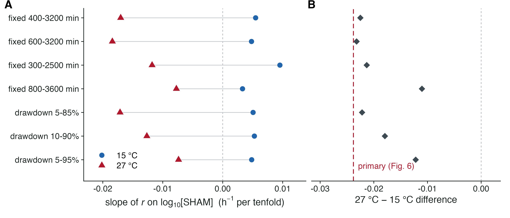
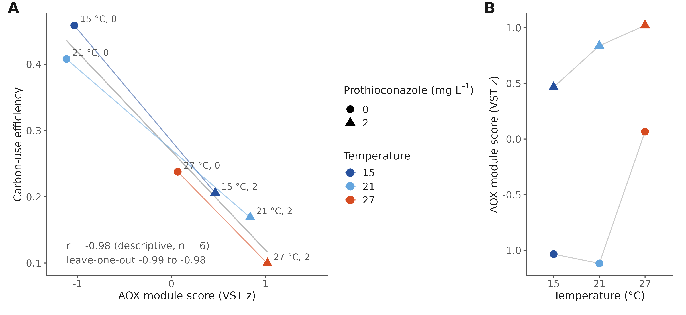
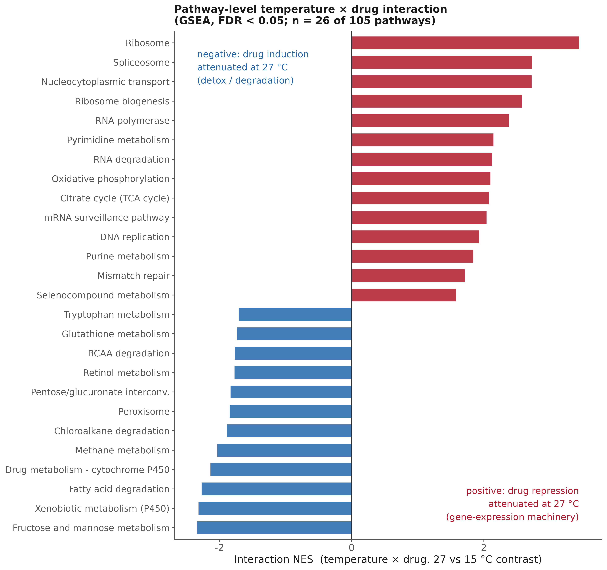
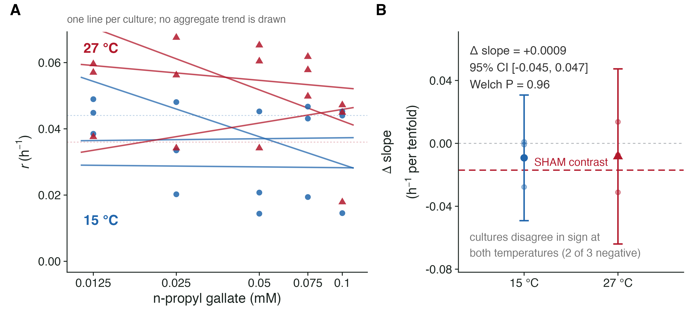
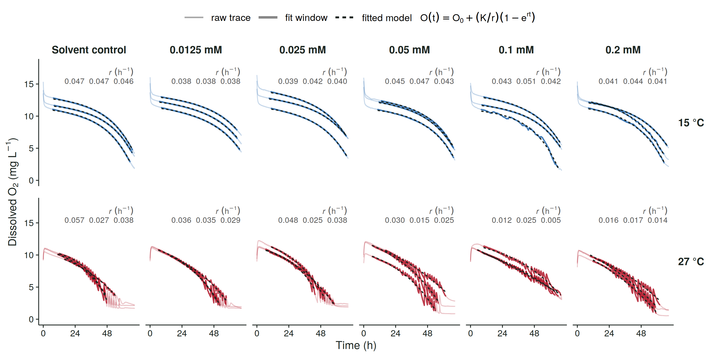
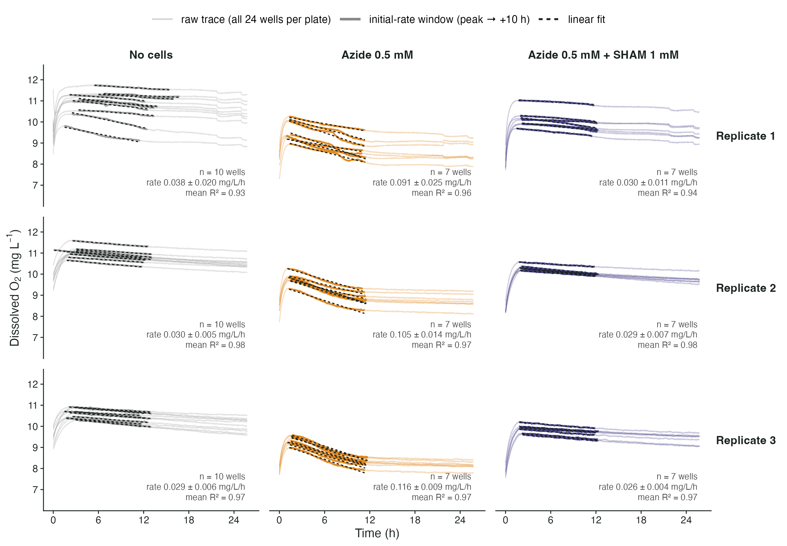
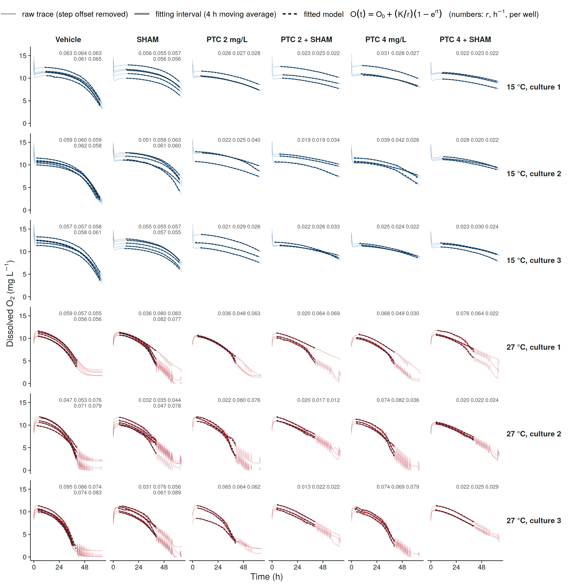
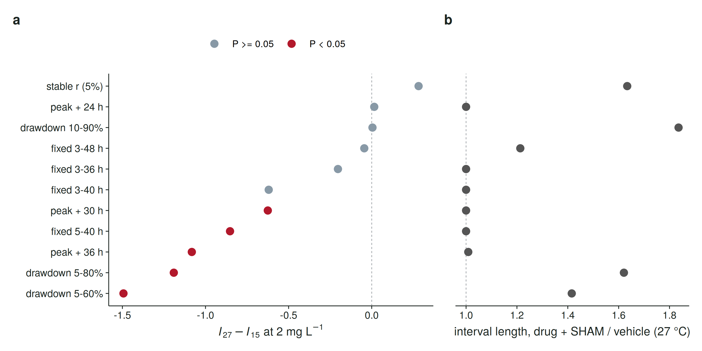
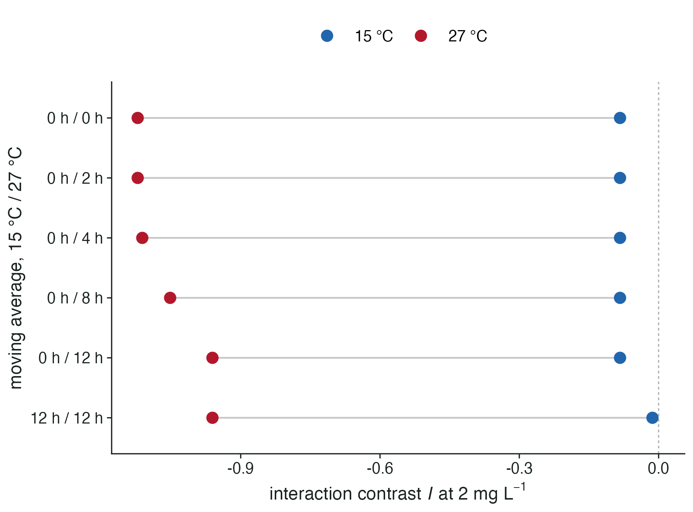

Ilgaz Cakin, Helen Fones, Nicholas Smirnoff, Samraat Pawar, Angus Buckling, Daniel Padfield, Gabriel Yvon-Durocher

This document contains Supplementary Figures S1–S20 and Supplementary Tables S1 and S2.

{width=6.3in}

**Figure S1. Thermal performance fit diagnostics.** Biomass-corrected growth (A) and respiration (B) rates for every retained replicate (points) with the posterior-median Sharpe–Schoolfield curve (line), faceted by prothioconazole dose; y-axes log₁₀-scaled.

\newpage

{width=6.3in}

**Figure S2. Posterior predictive checks.** Density overlays of 60 posterior-predictive replicates (light lines) against observed data (dark line) for the growth Hill model (A) and the respiration log-linear model (B). (C) Empirical coverage of the 95% predictive interval for each model class (0.93–0.97; dashed line, nominal 0.95).

\newpage

{width=6.3in}

**Figure S3. Growth dose–response by temperature.** Hill model posterior medians and 95% credible ribbons with raw replicate rates, one panel per assay temperature (15–28 °C).

\newpage

{width=6.3in}

**Figure S4. The ergosterol pathway is only mildly perturbed and the drug target is not transcriptionally induced.** (A) Group-mean expression (VST z-score) of ergosterol-pathway genes across all six conditions. (B) Per-gene prothioconazole log₂FC at each temperature. (C) Pathway activity score per sample. (D) CYP51/ERG11 versus AOX expression. (E) Per-gene temperature × drug interaction coefficients.

\newpage

{width=6.3in}

**Figure S5. The transcriptome-wide drug response contracts with warming.** (A) Empirical cumulative distribution of genome-wide |log₂FC| of the drug effect at each temperature. (B) Retention of the 15 °C-significant drug response at 21 and 27 °C (per-gene log₂FC scatter with slopes). (C) Gene-class tallies of response retention and loss. (D) Stress-programme module scores per condition: the 27 °C control already resembles drug-treated states. (E) Heat versus drug convergence at the gene level.

\newpage

{width=6.3in}

**Figure S6. Full KEGG pathway landscape of the prothioconazole response.** GSEA over the restricted KEGG universe at two FDR cutoffs, extending the FDR < 0.001 core shown in Fig. 3C.

\newpage

{width=6.3in}

**Figure S7. Gene-level view of the leading pathways.** Expression (log₂FC) of the largest-effect member genes of the pathways in Fig. S6 across temperatures.

\newpage

{width=6.3in}

**Figure S8. Gene-level convergence of the drug and warming programmes.** Each gene's peak prothioconazole effect (largest |log₂FC| across 15–27 °C) against its warming response (27 versus 15 °C). Significant genes are coloured by direction concordance (shared up, shared down, divergent), with the correlation and percentage responding in the same direction inset; AOX2 (shared) and CDR1 (drug-specific) are highlighted.

\newpage

{width=6.3in}

**Figure S9. Robustness of the physiological interaction analysis.** (A) Temperature-specific sensitivity (pEC₅₀) against baseline growth (r₀). (B) The 27 °C EC₅₀ exceeds the tested concentration range (extrapolation region shaded), so its absolute value is an extrapolation while its rank order is not. (C) The sign of the Bliss deviation (synergy at 15 °C, antagonism at 27 °C) is unchanged when the reference temperature is moved from 24 to 21 °C.

\newpage

{width=6.3in}

**Figure S10. Extended physiology–transcriptome integration.** (A–C) Functional module scores against condition-level physiological rates (Pearson r and P per panel), extending Fig. 5C,D. (D) Membrane and storage remodelling: mean shrunken log₂FC across membrane-lipid, storage-carbohydrate and related gene sets per condition. (E) Similarity of the 27 °C control transcriptome to each perturbed state, showing that supra-optimal heat alone most resembles drug exposure.

\newpage

{width=6.3in}

**Figure S11. A reference-free test confirms the temperature × fungicide interaction.** Log growth rate across all 156 replicate-level observations was fitted with penalised regression splines as a separable surface, log g = f(T) + h(c), and compared with the same surface plus a pure-interaction tensor term, + ti(T, c) (Methods). (A) The interaction residual F(T,c) − [f(T) + h(c)] against temperature, one line per prothioconazole concentration (posterior medians; dashed horizontal line, exact separability; vertical line, the 24 °C thermal optimum). (B) The same residual as a temperature × concentration surface, directly comparable with the Bliss deviation heatmap of Fig. 2F although computed without a reference temperature or a multiplicative null; blue indicates growth below the separable expectation (synergy) and red growth above it (antagonism). At the higher concentrations the residual is negative at 15 °C and positive at 27–28 °C, recovering the reversal. (C) Out-of-sample evidence: exact leave-one-out root-mean-square error of the two models, each refitted 156 times. Pointwise credible intervals on the residual surface include zero almost everywhere, so the evidence for interaction rests on the global model comparison and out-of-sample performance summarised in (C) rather than on individual points of the surface; sensitivity to the spline basis dimension is given in Table S1.

\newpage

{width=6.3in}

**Figure S12. The temperature contrast in SHAM sensitivity does not depend on the choice of fitting interval.** Growth rates were re-estimated for every well under seven alternative rules for the interval of the dissolved-oxygen trace over which the oxygen-consumption model is fitted: four fixed absolute windows (given in minutes from the start of the run) and three windows anchored to fixed fractions of each trace's own oxygen drawdown. The whole culture-level analysis was then repeated under each rule, with the 0.35 mM dose excluded throughout as in the main analysis. (A) The mean per-culture slope of growth rate on log₁₀ SHAM concentration at 15 °C (blue circles) and 27 °C (red triangles) under each rule; the dashed vertical line marks no dose effect. (B) The 27 °C minus 15 °C difference in that slope under each rule (grey diamonds), against the estimate from the hand-selected windows reported in Fig. 6 (red dashed line, −0.0238 h⁻¹ per tenfold). The 27 °C slope is more negative than the 15 °C slope under every rule, and the difference ranges from −0.011 to −0.023 h⁻¹ per tenfold, so the direction and approximate magnitude of the temperature contrast are not artefacts of the interval selection; the hand-selected windows give the largest estimate of the seven, so the primary figure is at the strong end of this range.

\newpage

{width=6.3in}

**Figure S13. Alternative-oxidase expression tracks the loss of carbon-use efficiency.** (A) Carbon-use efficiency against the AOX module score across the six transcriptomics conditions (colour, temperature; circles, 0 mg L⁻¹; triangles, 2 mg L⁻¹; thin coloured lines join the two doses at each temperature; grey line, the ordinary least-squares fit). The relationship is descriptive and rests on six condition means (Pearson r = −0.98; leave-one-condition-out range −0.99 to −0.98), so it identifies AOX induction as a marker of the low-efficiency state rather than establishing that AOX activity causes it; the causal test is the inhibitor experiment of Fig. 6. (B) The same AOX scores against temperature, showing that induction rises with temperature in the drug conditions and only at 27 °C without drug.

\newpage

{width=6.3in}

**Figure S14. Pathway-level temperature × drug interaction.** Gene-set enrichment analysis run on the DESeq2 temperature × prothioconazole interaction statistic (27 versus 15 °C contrast) over the same 105-pathway universe used throughout; the 26 pathways reaching FDR < 0.05 are shown, ordered by normalized enrichment score. Positive scores (red) mark pathways whose drug repression is attenuated at 27 °C, and these are the gene-expression machinery: ribosome, spliceosome, nucleocytoplasmic transport, ribosome biogenesis and RNA polymerase. Negative scores (blue) mark pathways whose drug induction is attenuated at 27 °C, and these are the detoxification and degradation pathways, including xenobiotic metabolism by cytochrome P450. ABC-transporter efflux does not reach significance in either direction, identifying it as the component of the drug response that persists at supra-optimal temperature.

\newpage

{width=6.3in}

**Figure S15. n-Propyl gallate yields an inconclusive temperature contrast in growth-rate dose responses.** Three independent cultures per temperature were assayed at 15 and 27 °C across an nPG concentration series with a maximum of 0.1 mM, set by the solubility of the ethanol master stock. No prothioconazole was present. Growth rates were estimated by fitting the same mechanistic dissolved-oxygen model used throughout to hand-selected time intervals, and a dose-response slope was estimated separately for each culture by regressing growth rate on log₁₀[nPG], excluding solvent controls; culture-level slopes are the units of the statistical comparison (n = 3 per temperature). (A) Growth rate against nPG concentration at 15 °C (blue circles) and 27 °C (red triangles). Each line is one culture's own regression and no aggregate trend is drawn, because averaging across cultures here would imply a consistency the data do not have: the three cultures disagree in sign at both temperatures. Dashed horizontal lines mark the solvent-control mean at each temperature. (B) Per-culture slopes (faint points), with the mean and its 95% confidence interval; the red dashed line marks the SHAM temperature contrast of Fig. 6. Mean slopes were −0.00921 and −0.00830 h⁻¹ per tenfold concentration increase at 15 and 27 °C. The estimated contrast (27 °C minus 15 °C) was +0.0009 h⁻¹ per tenfold (95% CI −0.0452 to +0.0470; two-sided Welch's t test, P = 0.96). That interval includes zero, the SHAM contrast (−0.0238) and effects of the opposite sign, so the experiment neither establishes equivalence between temperatures nor resolves a SHAM-sized contrast. Both mean slopes are negative, but neither reflects a consistent dose response: at each temperature two of three cultures lie near zero and the mean is set by a single divergent culture, whose exclusion leaves +0.00006 (15 °C) and +0.0031 (27 °C) h⁻¹ per tenfold. The corresponding SHAM slopes are negative in three of three cultures at 27 °C and positive in three of three at 15 °C. AOX target engagement was not measured for either compound, so the two concentration ranges cannot be equated as degrees of inhibition. Temperature was confounded with plate and run, one plate per temperature in dedicated incubators, and the interval reflects culture-level variation within those runs. At 27 °C the solvent controls, positioned in column 1, grew more slowly than every nPG-treated dose; they are excluded from slope estimation, and no positional explanation was established for this plate. Per-curve fits, their selected intervals and the fit diagnostics for all 78 inhibitor curves are given in Table S2.

\newpage

{width=6.3in}

**Figure S16. Dissolved-oxygen traces and model fits underlying the SHAM dose response (Fig. 6a, b).** All 36 curves: two temperatures (rows) × six SHAM concentrations (columns) × three cultures. Light lines, full raw traces; solid lines, the interval selected for fitting; dashed black lines, the fitted respiration model O(t) = O₀ + (K/r)(1 − e^{rt}), fitted by bounded nonlinear least squares over that interval (r is the per-culture growth rate plotted in Fig. 6a and listed in each panel). The 0.35 mM treatment is omitted, as in the main analysis (Fig. S12). The 27 °C traces carry a periodic component (period 1.5–4 h, growing to about 1.5 mg L⁻¹ peak-to-peak late in the run; residual s.d. after trend removal 0.19 mg L⁻¹ against 0.015 mg L⁻¹ at 15 °C) that is present in every well, including the solvent controls, and absent from the 15 °C plate and from the seven dose-response plates of Fig. 1, and is attributed to temperature cycling of the incubator used for that run. It is common-mode and does not enter the fitted rates: refitting all 36 curves after removing it with a 2 h or 4 h moving average changes r by a median of 0.5% (three curves by more than 5%, the largest 15%) and leaves the temperature contrast at −0.0234 h⁻¹ per tenfold (Welch's t, P = 0.025; `tables/aox/sham_denoise_sensitivity.csv`).

\newpage

{width=6.3in}

**Figure S17. Dissolved-oxygen traces and rate fits underlying the azide respirometry (Fig. 6c, d).** All 72 wells: three independent plates (rows; biological replicates) × three conditions (columns). Light lines, full raw traces; solid lines, the initial-rate window (post-equilibration maximum to +10 h); dashed black lines, linear fits over that window, whose slopes are the rates in Fig. 6d. Per-panel mean ± s.d. of well rates and mean R² are given. The plateau after about 10 h in azide-only wells is visible in every plate and lies outside the fitted window.

\newpage

{width=6.3in}

**Figure S18. Dissolved-oxygen traces and model fits underlying the prothioconazole × SHAM factorial (Fig. 6d-f).** All 132 fitted wells: six plates (rows; temperature × independent culture) × six conditions (columns). Light lines, full raw traces; solid lines, the fitting interval; dashed black lines, the fitted oxygen model O(t) = O₀ + (K/r)(1 − e^{rt}), fitted by bounded nonlinear least squares over that interval (per-well r values, h⁻¹, are printed in each panel and listed in `tables/aox/ptc_sham_well_rates.csv`). The plates were removed from the incubator at about 41 h for an interim export; the small offset on re-insertion was measured per well (`tables/aox/ptc_sham_steps.csv`) and subtracted from the later readings where an interval spans it. On the 27 °C plates the vehicle wells approach oxygen depletion by 40 h, so their intervals end there, whereas the drug + SHAM wells are still declining at 64 h. After the plates were moved to a second incubator at about 15 h, the cell-containing wells on the 27 °C plates show a 3 to 4 h sawtooth that is absent from the cell-free blanks on the same plates and therefore reflects periodic re-aeration of the medium rather than a sensor artefact; it is common to every well and is removed by the 12 h moving average applied to the 27 °C traces before fitting (Methods).

\newpage

**Table S1. Sensitivity of the reference-free interaction test to the spline basis dimension.** The pure-interaction tensor term ti(T, c) was refitted across basis dimensions for its temperature and dose margins, with the marginal smooths held at their reported dimensions. edf, effective degrees of freedom; ΔAIC, improvement over the separable model. The interaction is favoured at every setting, but support strengthens as the temperature basis becomes able to represent a sign reversal across the thermal optimum. Exact leave-one-out root-mean-square error is shown for the reported basis and for a coarser alternative.

| k (temperature × dose) | edf | F | P | ΔAIC | exact LOO RMSE |
|---|---|---|---|---|---|
| 3 × 3 | 1.00 | 4.40 | 0.038 | 2.66 | — |
| 3 × 4 | 2.31 | 2.19 | 0.069 | 3.03 | — |
| 4 × 3 | 2.77 | 4.29 | 0.0057 | 9.07 | 0.2272 |
| 4 × 4 | 2.77 | 4.29 | 0.0057 | 9.07 | — |
| 5 × 3 | 4.82 | 5.27 | 8.1 × 10⁻⁵ | 22.37 | — |
| 5 × 4 (reported) | 5.50 | 4.62 | 1.1 × 10⁻⁴ | 22.09 | 0.2162 |

: {tbl-colwidths="[24,10,10,16,12,18]"}

The separable model's exact leave-one-out RMSE is 0.2343.

\newpage

{width=6.3in}

**Figure S19. The prothioconazole × SHAM interaction under eleven alternative fitting rules.** The size of the interaction depends on the interval over which each oxygen trace is fitted, because the vehicle wells reach oxygen depletion sooner than the slow drug + SHAM wells, and fitting the flattening tail of a slow well lowers its estimated growth rate. All 132 curves were refitted under eleven rules that make no reference to the result: fixed absolute windows, windows of fixed duration anchored to each well's own post-equilibration maximum, windows anchored to fixed fractions of each trace's oxygen drawdown, and an end rule based on the stability of the fitted rate. (**a**) The paired contrast *I*₂₇ − *I*₁₅ at 2 mg L⁻¹ under each rule; points are coloured by whether the paired test reaches P < 0.05. (**b**) The symmetry diagnostic for each rule: the median fitted interval of the 27 °C drug + SHAM wells divided by that of the vehicle wells. A ratio above one means the slow wells were fitted over a longer span than the wells they are compared with, which inflates the contrast; rules of fixed duration anchored to each well's own maximum are symmetric by construction. The contrast is negative under eight of the eleven rules, including every rule whose intervals span 30 h or more, and is not detected under the shortest windows, where the combination has not yet diverged from the single agents.

\newpage

{width=6.3in}

**Figure S20. The interaction is not produced by the denoising of the 27 °C traces.** The growth rate is identified from the curvature of the oxygen decline, and a centred moving average attenuates curvature most in the fastest wells, so denoising applied only to the 27 °C plates could in principle create a negative interaction there. The hand-selected fitting intervals are held fixed and only the moving average is varied. The interaction contrast *I* at 2 mg L⁻¹ at each temperature as the moving average applied to the 27 °C traces is widened from none to 12 h, with 15 °C left unsmoothed, and in the last row with 12 h applied at both temperatures. *I*₂₇ moves from −1.12 with no smoothing to −0.96 at 12 h, so the effect is largest when nothing is done to the traces and the analysis reported in the main text is the most conservative of those tested; *I*₁₅ remains indistinguishable from zero throughout, including when the same 12 h average is applied to it (−0.01, P = 0.86). Values for every configuration are in `tables/aox/ptc_sham_preprocessing.csv`.

\newpage

**Table S2. Per-curve model fits for the alternative-oxidase inhibitor experiments.** One row per dissolved-oxygen curve for both inhibitors (78 curves: 42 SHAM, 36 nPG), giving the inhibitor, temperature, dose, culture, the fitted growth rate r, the oxygen-consumption parameter K, the hand-selected fitting interval, the number of points fitted, and the fit diagnostics R² and RMSE. The final column records whether the curve entered slope estimation; solvent controls do not, and the six SHAM curves at 0.35 mM are excluded because at 27 °C two of the three return rates at or near the lower bound of the model (0.000060 and 0.000447 h⁻¹) and are therefore not identifiable. R² and RMSE describe the quality of the curve fit only; they carry no information about target engagement or freedom from positional confounding. Supplied as `tables/aox/TableS2_per_curve_fits.csv`.
