Ilgaz Cakin, Helen Fones, Nicholas Smirnoff, Samraat Pawar, Angus Buckling, Daniel Padfield, Gabriel Yvon-Durocher

This document contains Supplementary Figures S1–S11.

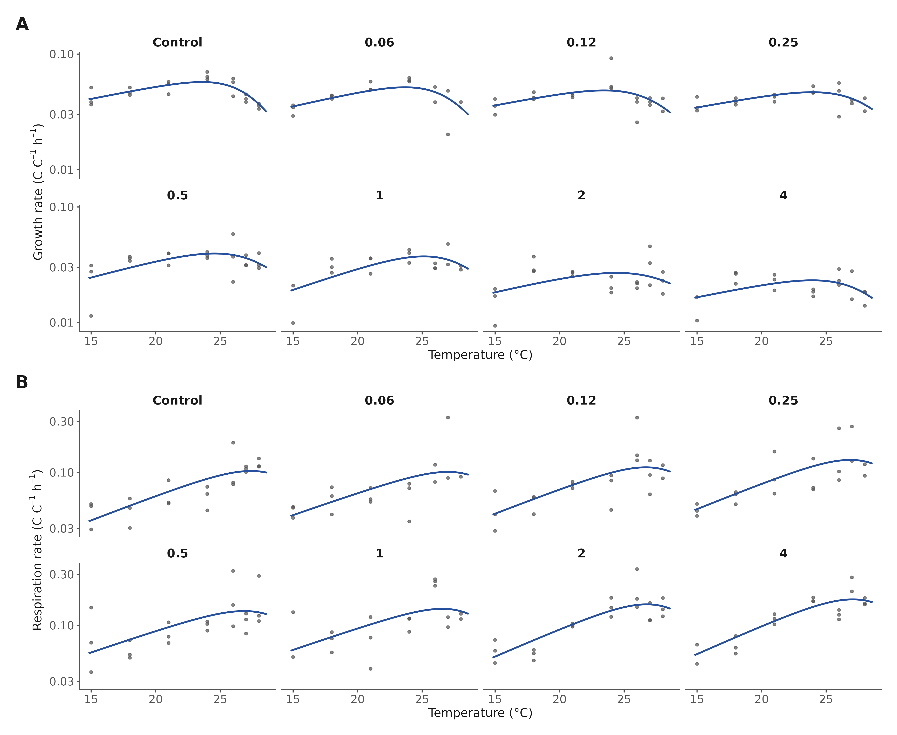{width=6.3in}

**Figure S1. Thermal performance fit diagnostics.** Biomass-corrected growth (A) and respiration (B) rates for every retained replicate (points) with the posterior-median Sharpe–Schoolfield curve (line), faceted by prothioconazole dose; y-axes log₁₀-scaled.

\newpage

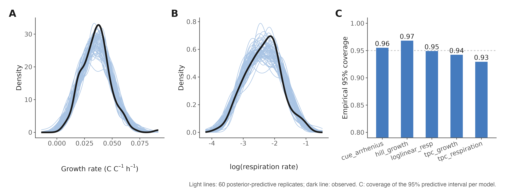{width=6.3in}

**Figure S2. Posterior predictive checks.** Density overlays of 60 posterior-predictive replicates (light lines) against observed data (dark line) for the growth Hill model (A) and the respiration log-linear model (B). (C) Empirical coverage of the 95% predictive interval for each model class (0.93–0.97; dashed line, nominal 0.95).

\newpage

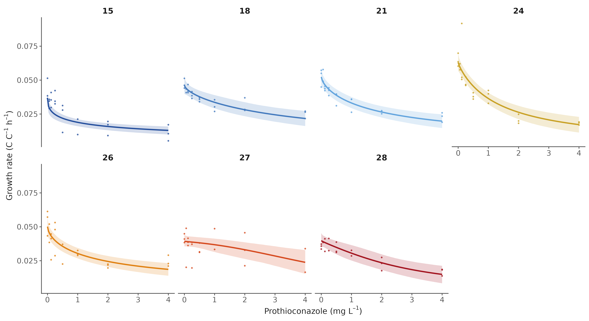{width=6.3in}

**Figure S3. Growth dose–response by temperature.** Hill model posterior medians and 95% credible ribbons with raw replicate rates, one panel per assay temperature (15–28 °C).

\newpage

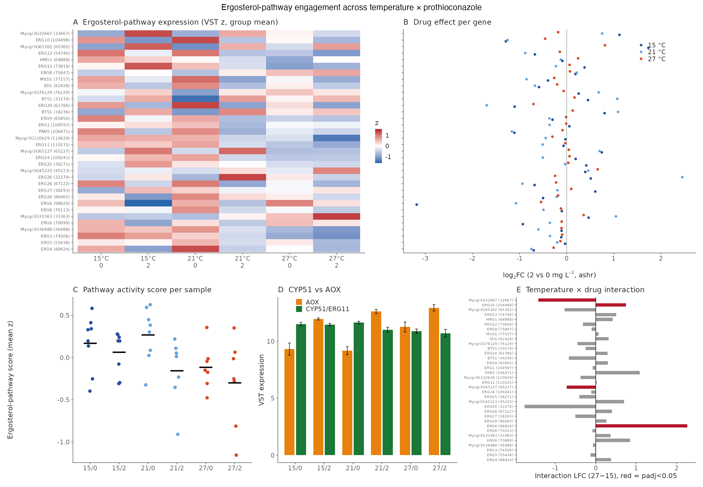{width=6.3in}

**Figure S4. The ergosterol pathway is only mildly perturbed and the drug target is not transcriptionally induced.** (A) Group-mean expression (VST z-score) of ergosterol-pathway genes across all six conditions. (B) Per-gene prothioconazole log₂FC at each temperature. (C) Pathway activity score per sample. (D) CYP51/ERG11 versus AOX expression. (E) Per-gene temperature × drug interaction coefficients.

\newpage

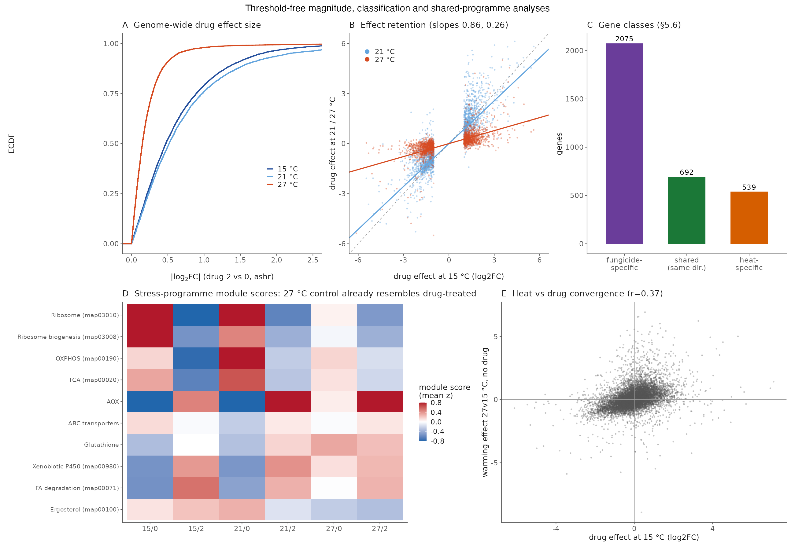{width=6.3in}

**Figure S5. The transcriptome-wide drug response contracts with warming.** (A) Empirical cumulative distribution of genome-wide |log₂FC| of the drug effect at each temperature. (B) Retention of the 15 °C-significant drug response at 21 and 27 °C (per-gene log₂FC scatter with slopes). (C) Gene-class tallies of response retention and loss. (D) Stress-programme module scores per condition: the 27 °C control already resembles drug-treated states. (E) Heat versus drug convergence at the gene level.

\newpage

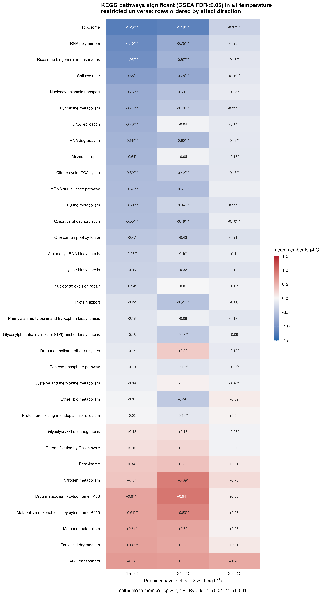{width=6.3in}

**Figure S6. Full KEGG pathway landscape of the prothioconazole response.** GSEA over the restricted KEGG universe at two FDR cutoffs, extending the FDR < 0.001 core shown in Fig. 3C.

\newpage

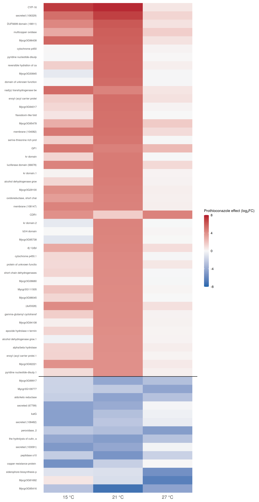{width=6.3in}

**Figure S7. Gene-level view of the leading pathways.** Expression (log₂FC) of the largest-effect member genes of the pathways in Fig. S6 across temperatures.

\newpage

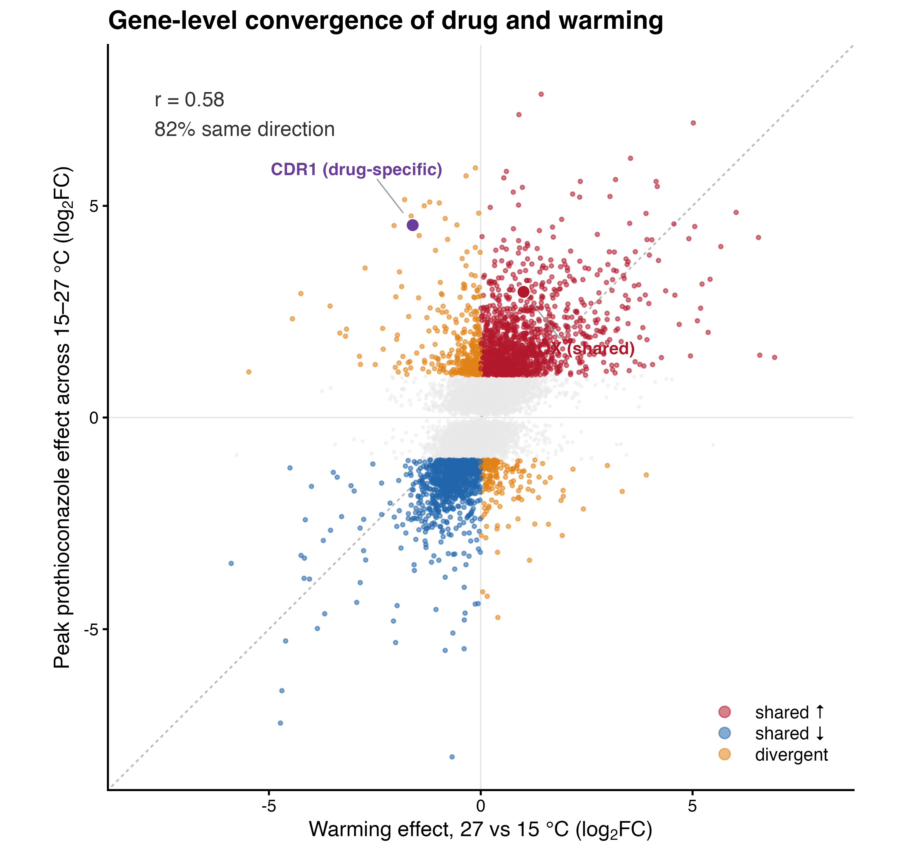{width=6.3in}

**Figure S8. Gene-level convergence of the drug and warming programmes.** Each gene's peak prothioconazole effect (largest |log₂FC| across 15–27 °C) against its warming response (27 versus 15 °C). Significant genes are coloured by direction concordance (shared up, shared down, divergent), with the correlation and percentage responding in the same direction inset; AOX2 (shared) and CDR1 (drug-specific) are highlighted.

\newpage

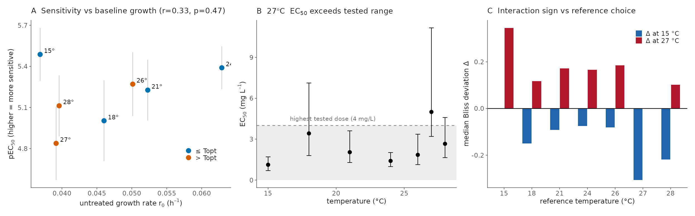{width=6.3in}

**Figure S9. Robustness of the physiological interaction analysis.** (A) Temperature-specific sensitivity (pEC₅₀) against baseline growth (r₀). (B) The 27 °C EC₅₀ exceeds the tested concentration range (extrapolation region shaded), so its absolute value is an extrapolation while its rank order is not. (C) The sign of the Bliss deviation (synergy at 15 °C, antagonism at 27 °C) is unchanged when the reference temperature is moved from 24 to 21 °C.

\newpage

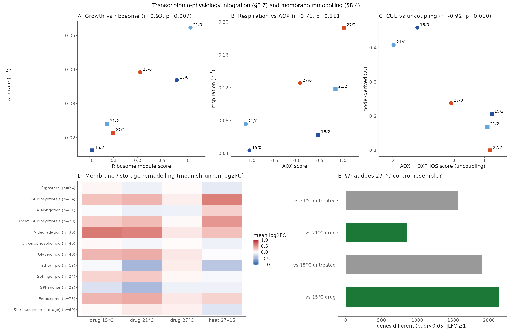{width=6.3in}

**Figure S10. Extended physiology–transcriptome integration.** (A–C) Functional module scores against condition-level physiological rates (Pearson r and P per panel), extending Fig. 5C,D. (D) Membrane and storage remodelling: mean shrunken log₂FC across membrane-lipid, storage-carbohydrate and related gene sets per condition. (E) Similarity of the 27 °C control transcriptome to each perturbed state, showing that supra-optimal heat alone most resembles drug exposure.

\newpage

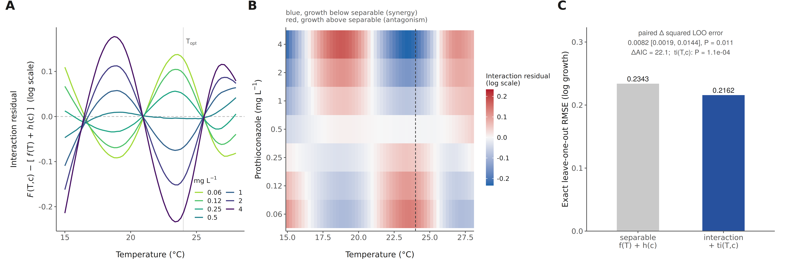{width=6.3in}

**Figure S11. Grounding and calibration diagnostics for the genome-scale metabolic model.** (A) Distribution of sequence-predicted melting temperatures (TemStaPro pseudo-T_m) for the 742 model enzymes; dashed lines mark the RNA-seq assay temperatures. (B) Temperature-dependent turnover predictions (DLTKcat): median and interquartile range of per-reaction log₁₀ k_cat across the 5–45 °C grid, with the azole target CYP51 (r_0317) highlighted. (C) The model-required AOX share of oxygen consumption against measured AOX transcript abundance (VST) across the six conditions (Spearman ρ = 0.99); point colour encodes temperature and marker shape dose. (D) Bayesian calibration of the four global enzyme parameters against the control TPC, shown as an identifiability analysis: emergent model (dashed), posterior median and 90% posterior-predictive band (solid line and shading), and measured growth (points). Only the melting-temperature shift is curve-constrained (−14.1 K, 90% CI −15.0 to −11.0, abutting the prior bound); the posterior sharpens the falling limb at the cost of the measured optimum and does not close the ~3-fold magnitude gap, so all downstream analyses use the uncalibrated model.
